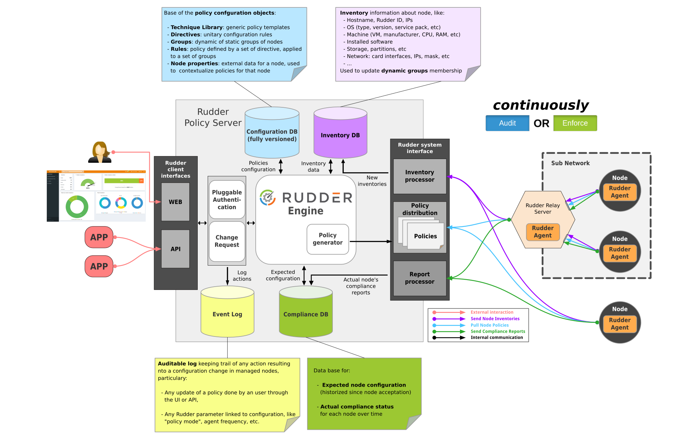

= Rudder: Continuous Auditing & Configuration

image::readme-resources/color_logo_horizontal_small.png[Rudder]

image:https://img.shields.io/badge/chat-with the community-brightgreen.svg?style=flat[link="https://docs.rudder.io"]
image:https://img.shields.io/badge/read-the documentation-green.svg?style=flat[link="https://docs.rudder.io"]
image:https://img.shields.io/badge/open-an issue-blue.svg?style=flat[link="https://issues.rudder.io"]
image:https://img.shields.io/badge/visit-our website-blueviolet.svg?style=flat[link="https://issues.rudder.io"]
image:https://img.shields.io/badge/donate-to support development-yellow.svg?style=flat[link="https://salt.bountysource.com/teams/rudder"]
image:https://img.shields.io/twitter/follow/rudderio.svg?style=social[link="https://twitter.com/rudderio"]

Rudder is an easy to use, web-driven, role-based solution for IT Infrastructure Automation & Compliance.

image::readme-resources/dashboard.png[Rudder Dashboard]

'''

* Rudder is made of several components:

** A *central server* (written in Scala) that defines the configurations to apply and collects application reports, with a focus on *continuously checking configurations* and centralising real-time status data. A *graphical builder* lowers the technical level required to define policies. Each policy can be independently set to be automatically *checked or enforced* on a policy or host level.

** *Agents* installed on the managed nodes. As they are *very lightweight* (10 to 20 MB of RAM at peak) and blazingly fast (they are written in C and takes less than 10 seconds to verify 100 rules), they *run on almost every kind of device*, so you’ll be managing physical and virtual servers in the data center, cloud instances, and embedded IoT devices in the same way. Installation is self-contained, via a single package, and can auto-update to limit agent management burden.

** *Relay servers* (optional) that allows managing nodes in different networks, or on different site through a single entry point.

* Rudder is designed for *critical environments* where a security breach can mean more than a blip in the sales stats. Built-in features include change requests, audit logs, and strong authentication.

* The workflow offers different users options at their own level:

** *Non-expert users* can define parameters in a central interface, and Rudder will automatically make sure that your IT services are installed, configured, running and in good health. All actions (checks, warnings, fixed errors…) are reported upon immediately in the user interface, keeping drift from nominal behaviour low.
** *Expert users* can configure how to implement these parameters on different systems, or build upon the pre-defined library provided using the CLI or API.
** *Managers* can consult compliance reports and access audit logs.

Rudder is an established project with several *tens of thousands of managed nodes*, in companies from small to biggest-in-their-field. Typical deployments manage 100s to 1000s of nodes. The biggest known deployments are about 10k nodes on a single Rudder server.

→ Read more about Rudder features https://www.rudder.io/en/discover/what-is-rudder/[on our website].

== Test Rudder

* You can try a https://demo.rudder.io[demo version of Rudder web interface] with fake nodes and compliance data.
* *Get started* with a https://docs.rudder.io/get-started/current/index.html[step-by-step guide] to setup a test environment and learn how to configure simple rules!
* *Get in touch*: if you encounter any problem while testing or have any question, *https://chat.rudder.io[come chat with the community]*!

== Installation

The easiest way to test and use Rudder for prototyping or production is to install it from the provided Linux packages.
For the *server*, the main current .rpm-based (Red Hat, CentOS, SLES) and .deb-based
(Debian, Ubuntu) distributions are supported.

Rudder *agent* is extremely versatile and packages are available for a wide range of
versions of RedHat, CentOS, SLES, Debian and Ubuntu (like RHEL3 or Debian
Lenny). It works on other distributions as well, like Slackware, Raspbian and other
embedded Linux on ARM/x86, FreeBSD but no ready-to-use packages are provided today).

Support for AIX, Solaris and Windows agents is provided as part of https://www.rudder.io/en/pricing/subscription/[Rudder subscription].

To install Rudder:

* Read about the https://docs.rudder.io/reference/current/installation/operating_systems.html[compatible operating systems] and the https://docs.rudder.io/reference/current/installation/requirements.html[requirements] before starting
* For a quick installation, we provide an https://docs.rudder.io/reference/current/installation/quick_install.html[automated installation script]
* For a complete installation, follow the https://docs.rudder.io/reference/current/installation/server/debian.html[documentation]

== Links

[horizontal]
Website:: https://www.rudder.io
Documentation:: https://docs.rudder.io
API documentation:: https://docs.rudder.io/api
Chat:: https://chat.rudder.io
Bug report:: https://issues.rudder.io/projects/rudder/issues
Source:: https://github.com/Normation/rudder

== Contribute

Thank you for your interest in our project! We welcome pull requests on any of the Rudder repositories.

The contribution process is detailed here: https://www.rudder.io/en/expand/contribute/

Rudder is composed of https://www.rudder.io/en/expand/contribute/#panel-2422-6-0-0[several sub-projects]. The contribution process is detailed https://www.rudder.io/en/expand/contribute/[on our website].

== Rudder components and projects overview

=== Functional Components

=== Projects

Rudder is composed of several repositories:

|====
|Component | Description and Repositories

| Rudder documentation |
We have a project for main documentation and API documentation:
https://github.com/Normation/rudder-doc
https://github.com/Normation/rudder-api-doc

| Rudder agent |
This project contains the CLI for Rudder agent
https://github.com/Normation/rudder-agent

| Rudder configuration policies |
Provided techniques coming in the base set-up of Rudder
https://github.com/Normation/rudder-techniques

The structured configuration framework used to build Rudder techniques
https://github.com/Normation/ncf

| Rudder server |
This is the Scala web application responsible for policy definition and
generation by node, and compliance reporting. It also manages node
inventories.
https://github.com/Normation/rudder

| Rudder packages |
This project contains all the logic to build both server and agent packages for Rudder
https://github.com/Normation/rudder-packages

| Rudder tools |
Nice tools around Rudder, including various user-contributed scripts.
https://github.com/Normation/rudder-tools

| Rudder plugins |
https://github.com/Normation/rudder-plugins
https://github.com/Normation/rudder-plugin-itop

|====

== Authors

Rudder is supported by https://www.rudder.io/en/company/about-us/[Normation].

The list of contributors is available in https://github.com/Normation/rudder/graphs/contributors

== License

This project is licensed under GPLv3 license, see the provided https://github.com/Normation/rudder/blob/master/LICENSE[LICENSE] (or
its http://www.gnu.org/licenses/gpl-3.0.txt[source]).

We added an extension to the main GPLv3 license to allows to build and use plugins
on top of Rudder with any license, open source or closed/proprietary, see the https://github.com/Normation/rudder/blob/master/LICENSE_EXCEPTION[LICENSE_EXCEPTION].
