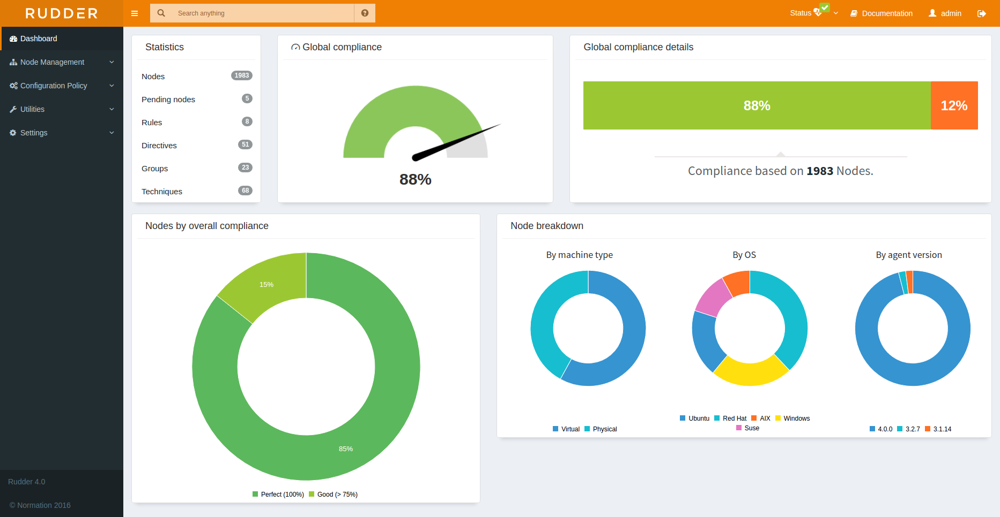

test²:w

<h1 align="center">
    <a href="https://www.rudder.io" target="blank_">
          <picture>
              <source media="(prefers-color-scheme: dark)" srcset="https://raw.githubusercontent.com/Normation/rudder/master/logo/icons/svg/rudder-logo-rect-white.svg">
              <source media="(prefers-color-scheme: light)" srcset="https://raw.githubusercontent.com/Normation/rudder/master/logo/icons/svg/rudder-logo-rect-black.svg">
              
        </picture>
    </a>
    <br>
    Infrastructure automation<br/>for security posture
</h1>

<p align="center">
    <a href="https://www.rudder.io/">Website</a> •
    <a href="https://docs.rudder.io/">Docs</a> •
    <a href="https://chat.rudder.io">Chat</a> •
    <a href="https://www.youtube.com/user/RudderProject">Videos</a> •
    <a href="https://issues.rudder.io/">Bug tracker</a>
    <br><br>
    <a href="https://twitter.com/rudderio">X (Twitter)</a> •
    <a href="https://bsky.app/profile/rudder.io">Bluesky</a> •
    <a href="https://mamot.fr/@rudderio">Mastodon</a> •
    <a href="https://www.linkedin.com/company/rudderbynormation/">LinkedIn</a>
</p>

<div align="center">
    <a href="https://www.rudder.io" target="blank_">
        
    </a>
</div>

## What is Rudder?

Rudder is a system infrastructure automation platform, dedicated to empowering IT operational teams
to ensure and improve their security posture and fostering collaboration in Security Operations (SecOps).

### Features

- **Security posture management:** Automate critical IT operations to fortify infrastructure security:
  - Automated systems inventory
  - Patch management
  - Vulnerability management
  - System hardening and security standards compliance
- **Configuration management:** Streamline and automate configuration tasks for enhanced reliability, with advanced compliance visualization. Configuration policies can be created seamlessly using a visual editor, or YAML code.
- **Multi-platform support:** Manage diverse environments, including Cloud, hybrid, and on-premise setups, running on Linux or Windows.
- **Scalable and Dynamic approach:** A scalable and dynamic approach to infrastructure management, including a powerful hierarchical configuration data engine and automated classification of managed systems. Typical deployments manage 100s to 1000s of systems, and a single Rudder server can manage more than 10k systems.

Learn more about Rudder features and use cases [on the website](https://www.rudder.io/).

### Online demo

Browse the [demo Web interface](https://demo.rudder.io) (with fake data) to get a glimpse of the available features and interfaces.

<a href="https://demo.rudder.io"></a>

### Components

A Rudder installation is made of:

* A central server, providing the Web interface, the [HTTP API](https://docs.rudder.io/api) and the automation engine. It can be extended with plugins.
* (optional) Relays acting as smart proxies between the server and the agents.
* A light agent installed on every managed system. It runs autonomously and check and/or modifies the state of the system continuously (in practice, every 5 minutes by default).

## Install Rudder

> [!TIP]
> You need an active subscription to get a complete setup, including Rudder's security features. Without a subscription
> you will get access to [Rudder Core](#rudder-core) only.
> It you want to evaluate how Rudder can help you, you can [ask for a free trial](https://www.rudder.io/free-trial/) on the website.
>
> If you have installed Rudder Core, you can upgrade it at any time to a subscription
> or a free trial license.

### Standard installation

Follow the step-by-step instructions of the documentation to setup Rudder:

* 📥 [**Install Rudder**](https://docs.rudder.io/reference/current/installation/index.html), with or without a subscription.
* You can then follow the [get started documentation](https://docs.rudder.io/get-started/current/configuration-policies/index.html) to discover the features with a hands-on tutorial.

### Quick installation

Alternatively, for a quick setup on Linux systems, you can use the installer script.
For a Rudder server:

```bash
curl --proto '=https' --tlsv1.2 -sSf https://repository.rudder.io/tools/rudder-setup | sh -s -- setup-server latest
```

For a Rudder agent, replace `SERVER` by you Rudder server's IP or hostname:

```bash
curl --proto '=https' --tlsv1.2 -sSf https://repository.rudder.io/tools/rudder-setup | sh -s -- setup-agent latest SERVER
```

For more options and to review the script before running it:

```bash
wget https://repository.rudder.io/tools/rudder-setup
chmod +x rudder-setup
./rudder-setup -h
```

## FAQ

<a name="rudder-core"></a>
### Is Rudder open-source? Is it free? What is Rudder Core?

Rudder has adopted an _open-core_ model:

* **Rudder Core** is available for free and totally open-source (under GPL 3.0 an Apache 2.0). It includes the main Rudder components, Linux agents, plus several plugins.
* The complete **Rudder** solution is paid and partially open-source. A part of the paid plugins and agents are distributed under proprietary license. It also includes other benefits:

    - Additional plugins that add major features
    - Support for older versions on Linux distributions
    - Support for additional architectures (ARM & Power)
    - Support for Windows
    - Extended support for Rudder releases
    - Professional support, user assistance
    - Training

They serve different purposes:

* **Rudder Core** is a versatile automation engine for mainstream Linux systems with a complete Web UI, built to give access to essential configuration management and inventory features to small businesses and individuals.
* **Rudder** is a multi-platform operational security solution, answering the needs of most organizations, including enterprise setup and critical infrastructures.

Rudder Core is a subset of the full solution, and the packages publicly available are identical the packages provided to subscription users, with the same QA and security processes. This is not a two-speed model, but a "two-scope" model.

### Do I need to reinstall anything if upgrading from Rudder Core to a subscription?

The full Rudder solution is a direct super-set of Rudder Core, so you don't have to
reinstall anything and your server and agents are compatible with the additional
features which come as plugins.

You may just need to change the repository URL on your systems to benefit from the extended
maintenance in the future.

### What is the governance structure of the Rudder project?

The project is lead by the French (🇫🇷🇪🇺) company of the same name (previously known as *Normation*).

### Where can I find support for Rudder?

The best option is through a [Rudder subscription](https://www.rudder.io/pricing/) which includes professional support. Users of Rudder Core can find help on the community channels.

### How to join the community?

Join our community on [GitHub Discussions](https://github.com/amousset/rudder/discussions) or our [Gitter/Element chat](https://app.gitter.im/#/room/#rudder:gitter.im) for support, feedback, and collaboration.

### How long are Rudder versions maintained?

Rudder uses a `MAJOR.MINOR.PATCH` versioning scheme:

* Minor (or Major) releases: A new minor or major version of Rudder is typically released approximately every 6 months. These releases introduce new features, enhancements, and improvements.
* Patch releases: For the maintenance of existing versions, a new patch release covering all currently maintained versions is released approximately every month. These releases focus on bug fixes and security updates.

Maintenance policy:

* Users of Rudder Core have a 3-month window to upgrade to the newest minor or major version after its release. This ensures that users can take advantage of the latest features and security enhancements promptly.
* With a subscription, major releases are maintained for an extended period of 18 to 24 months after their initial release. Subscribers also benefit from an extended upgrade window of 6 to 9 months between minor versions. This extended time-frame allows for strategic planning and execution of version upgrades.

Get the list of currently maintained versions [in the documentation](https://docs.rudder.io/versions).

## Contributing 

### How can I get involved with the Rudder project?

All kinds of contributions are welcome, including code, documentation, examples of Rudder use cases,
feedback about your usage, etc.
If you are interested, you can come talk with the development team, is often present in the [chat room](https://char.rudder.io),
or open a discussion directly on GitHub.

### Contributor License Agreement

We require a signed individual or entity Contributor License Agreement (CLA) before we can merge any significant code or documentation change to Rudder.

Given the recent developments in the legal framework surrounding patents, copyrights, and their use, we want to be very clear about what we give and wait in return before we can accept a contribution. We want to be able to evolve with all these legal issues, and be able to defend the project if something unpleasant happens, or simply if a contributor changes their mind. Prevention is better than cure!

* If you are making a personal contribution, here is the reference text to consult: [individual CLA](https://sign.signable.app/widget/xs2adbWSXS).
* If you are contributing on behalf of a company, consult this version: [entity CLA](https://sign.signable.app/#/widget/4YpYMVZKWG).

Our text is based on the CLA provided by the [Harmony Agreement Project](https://www.harmonyagreements.org/). The Harmony agreements are a community group focused on contribution agreements for free and open source software (FOSS).

## Security

Please refer to [Rudder's security process](SECURITY.md).

## License

This project is licensed under GPLv3 license, see the provided [LICENSE](https://github.com/Normation/rudder/blob/master/LICENSE) (or
its [source](http://www.gnu.org/licenses/gpl-3.0.txt)).

We add an exception to the main GPLv3 license that allows to build and use plugins
on top of Rudder with any license, open source or closed/proprietary, see the [LICENSE_EXCEPTION](https://github.com/Normation/rudder/blob/master/LICENSE_EXCEPTION).

