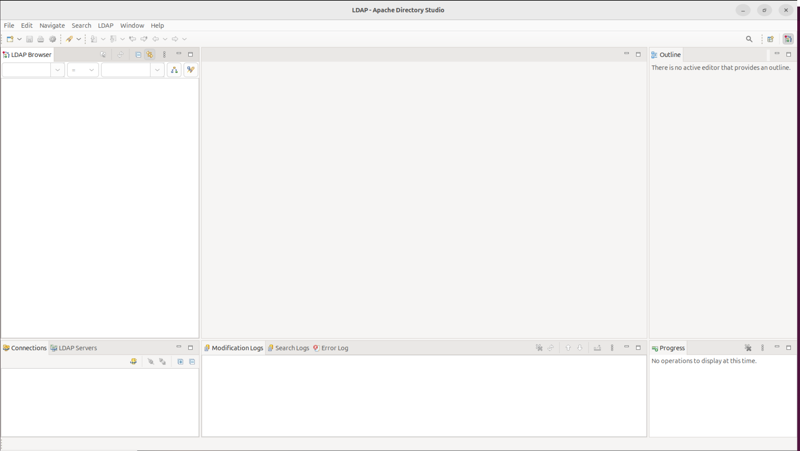

<style>
    .pitfall {
        border-radius: 5px; 
        margin: 0 0 1em; 
        padding: 0.5em 1em; 
        border: 3px solid #ffb46e; 
        background-color: #ff7b00; 
        font-style: italic; 
        color:white;
    }
    .code-format {
        color:white;
    }
    code .pitfall {
        color:white;
    }

    .success {
        border-radius: 5px; 
        margin: 0 0 1em; 
        padding: 0.5em 1em; 
        border: 3px solid #488759; 
        background-color: #0a521d; 
        font-style: italic;
    }   
    code .success {
        color: white;
    }

</style>

# How to setup your development's environment for Rudder's web application

## Synopsis
This is a **straightforward guide** aims to setup all tools and settings on a Linux OS, to be able to modify Rudder source code and to test it locally. Please follow this guide step by step. If you want to learn more about the tools feel free to read the document link to it !

> Note: the documentation is written for linux ubuntu, with `apt`, of course you are free to use another os and his own package manager.

## Requirements for your machine
- Vagrant
- Virtual Box and Oracle VM VirutalBox Extension pack
- IntelliJ
- OpenJDK latest LTS
- git
- netstat

## Part 0 : Installation of required packages and softwares

### VirtualBox installation

Run `sudo apt install virtualbox` in a terminal.

### Vagrant installation

Follow the Vagrant install tutorial https://developer.hashicorp.com/vagrant/install.

Edit `~/<workspace>/rudder-tests/Vagrantfile` and replace the values of `DOWNLOAD_USER` and `DOWNLOAD_PASSWORD` with proper values.
```
$DOWNLOAD_USER="<user>"
$DOWNLOAD_PASSWORD="<password>"
```

### Intellij Idea Community installation

- Download intellij idea community edition (not the ultimate edition) https://www.jetbrains.com/idea/download/?section=linux
- Install intellij in `/usr/local/bin`
- Run `/usr/local/bin/<intellij path>/bin/idea.sh`
- Create a command line launcher by going running `Create a command line launcher...` from the `Tools` menu
- Edit `~/.bashrc` and add Intellij bin path to `$PATH`, save and close `.bashrc`

> Note: this is an example of path to add in the .bashrc file `export $PATH="/usr/local/bin/idea-IC-252.25557.131/bin:$PATH"`
- Source `.bashrc` to update `$PATH` running `source ~/.bashrc` in your terminal
- Check if the `$PATH` is properly updated by running `echo $PATH` you should the idea path. For instance:
```
pauline@ThinkPad-T14s-Gen-6$ echo $PATH
/usr/local/bin/idea-IC-252.25557.131/bin:/usr/local/sbin:/usr/local/bin:/usr/sbin:/usr/bin:/sbin:/bin:/usr/games:/usr/local/games:/snap/bin:/snap/bin
```

<div class="success">
<span style="font-weight: bold;">Congrats!</span> You can start intellij in command line from anywhere by executing <code>idea</code> in a terminal.
</div>


- Create a Desktop entry by running `Create a desktop entry...` from the `Tools` menu, see https://youtrack.jetbrains.com/articles/SUPPORT-A-56/How-to-handle-Switch-to-a-native-launcher-notification

<div class="success">
<span style="font-weight: bold;">Congrats!</span> Now you can exit IDEA and start it from the system menu. If a new menu entry is not shown, restart your login session.
</div>

### Install a jre

Install a recent jre, the latest LTS version should be fine.

> Note: avoid using `apt` to install an open jdk, the jdk packaged by ubuntu do not work (strange behaviors compiling rudder webapp). 

> Suggestion: see `jdkman` for a handy open source java installer.

Run `java -version` to validate

### ldap apache directory studio installation

> Note: a jre is required

Download and install `ApacheDirectoryStudio`. https://directory.apache.org/studio/download/download-linux.html#verifyIntegrity in `/usr/local/bin`.
Add `/usr/local/bin/ApacheDirectoryStudio` path in the `$PATH` variable of the `~/.barshrc` file.

Run `ApacheDirectoryStudio`



<div class="success">
<span style="font-weight: bold;">Congrats!</span> You succeed to run <code class="code-format">ApachDirectoryStudio</code>
</div>

### Rudder Test framework (RTF) installation

The rudder test framework is mainly used to start virtual machines in order to test rudder in real life conditions or to test the rudder running on your own machine (dev mode).</br>

Please follow these [steps](https://github.com/Normation/rudder-tests#rudder-tests) to install Rudder Test framework

Follow these instructions to  [rudder-api-client](https://github.com/Normation/rudder-api-client) then create a symlink in `rudder-tests` :

```
ln -s <rudder-api-client directory's path>
```
Run `./rtf` will validate `virtualbox` and `vagrant` are running properly.
Pick an existing platform in `rudder-tests/platforms` for instance `debian13` (choose the latest version and drop the extension file) and run:
```
cd ~/Workspace/rudder-tests
./rtf platorm setup debian<latest>
```

<div class="pitfall">
<span style="font-weight: bold;">Pitfall</span>: maybe you will need to disable the secure boot in the bios
</div>

<div class="pitfall">
<span style="font-weight: bold;">Pitfall</span>: maybe you will need to update the address used to be within the allowed
ranges and run the command again if the IP address configured for the host-only network is not within the
allowed ranges. </br> 
Valid ranges can be modified in the <code class="code-format">/etc/vbox/networks.conf</code> file. </br>
For more information including valid format see:</br>

https://www.virtualbox.org/manual/ch06.html#network_hostonly

</div>

<div class="pitfall">
<span style="font-weight: bold;">Pitfall</span>: When running ./rtf

<code style="color:white;">Stderr: Warning: program compiled against libxml 212 using older 209</code>
<br />
If you have this error the version of ubuntu and virtualbox are probably incompatible. Maybe you downloaded a .deb file from the website not compatible with your system.<br/>

If so remove the .deb: <br />
<code style="color: white;">ps aux | grep -i vbox</code><br/>
<code style="color: white;">sudo apt purge virtualbox-<version></code><br/>
<code style="color: white;">sudo apt install virtualbox</code><br/>

You can also update your system.

</div>

<div class="pitfall">
<span style="font-weight: bold;">Pitfall</span>: When running ./rtf

<span style="font-family: Courier New;">Stderr: VBoxManage: error: VirtualBox can't enable the AMD-V extension. Please disable the KVM kernel extension, recompile your kernel and reboot (VERR_SVM_IN_USE)</span>
</div>


Run <code>VirtualBox</code>, you should see 3 virtual machines running.
<div class="success">
<span style="font-weight: bold;">Congrats!</span> You succeed to run <code class="code-format">./rtf</code> which validates <code class="code-format">virtualbox</code> and <code class="code-format">vagrant</code>. Now let's go further and see how to configure <code class="code-format">rudder-tests</code> for your needs.

</div>

## Part 1 : Setup `rudder-tests` and `rudder` local environment

### Setup virtual machines for testing

#### Platform description file

The platform description file is the input to `rtf setup` command so `rtf` can start virtual machines with server, agents, os and rudder version described. </br>

Go into the cloned `rudder-tests` github repository. The directory `rudder-tests/platforms/` contains examples of platform configurations.
Please read https://github.com/Normation/rudder-tests#adding-a-platform-or-an-os for further information.

Create a `<dev_env_name>.json` file in `./platform/` and put your platform's configuration in it.
Here is the most minimalistic example of a functional configuration:

```json
{
  "default":{ "run-with": "vagrant", "rudder-version": "6.0",
  "system": "debian9", "inventory-os": "debian" },
  "server": { "rudder-setup": "dev-server" }
}
```
Depending on your needs, a relay and some agents can be added:
```json
...
  "relay":  { "rudder-setup": "relay" },
  "agent1": { "rudder-setup": "agent", "system" : "debian8", "server": "relay" },
  "agent2": { "rudder-setup": "agent", "system" : "debian7" },
...
```
> Note: for testing purpose a local development environment is needed: this implies that the `server` field must at least contain `"rudder-setup": "dev-server"`.\
But if you only want to test Rudder without making any changes to the source code, replace `"rudder-setup": "dev-server"` by `"rudder-setup": "server"`

> Note: you will not be able to access Rudder at this stage, you will need to setup and run Rudder through IntelliJ to be able to access it locally.

When your file is ready, you will have to create and prepare the box by running :
```
./rtf platform setup <env's name>
```
> Important note: always do either:
- `./rtf platform setup <env's name>` from the `rudder-tests` folder, or
- `vagrant up <VM_id>`. The `<VM_id>` can be found by doing `vagrant global-status` as the user that created the VM in the first place

Some test environment run a postgresql database. The default port of postgresql is `5432` and the default port forwarded is `15432`.
Now you can test that the environment is working by netstat shows some connection on the port `15432`:
```
sudo netstat -laputn | grep 15432
```
The output should be:
```
tcp        0      0 0.0.0.0:15432           0.0.0.0:*               LISTEN
```
You can find the port number back in the Vagrantfile.

> For an eventual later use: this will not be necessary in this guide, but if you want to connect to the box, use (in `rudder-test` directory) :
```
vagrant ssh <env's name>_server
```
<div class="success">
<span style="font-weight: bold;">Congrats!</span> You succeed to start your own test environment.
</div>

#### Test LDAP connection

> Goal: connect `ApacheDirectoryStudio` to the ldap running in the virtual machine started with `rtf`

1. Connect to your vagrant box env, in `rudder-tests` directory :
```
vagrant ssh <env's name>_server
```

2. In vagrant box, find in `/opt/rudder/etc/openldap/slapd.conf` the two lines starting with `rootdn` and `rootpw` and keep them for the next section, those value are gonna be useful to configure the ldap connection.
   rootdn should look like that :
   `rootdn   "cn=Manager,cn=rudder-configuration"`

> Note: You have to open the file with a root user, or you will see an empty file which is totally confusing.

3. Run Apache Directory Studio (installed in Part 0)
4. in _LDAP -> New Connection_
- define a connection's name
- Hostname : localhost
- Port : 1389

Click on _Check Network Parameter_, a windows should appear and tell you that the connection was established successfully
if so click on next


3. Complete with following parameters :
- Bind DN or user : `cn=Manager,cn=rudder-configuration` (`rootdn` parameter from previous step)
- Bind password : the `rootpw` value
  click on Check the Authentication, it should be a success, click on apply and close if so
  

Your LDAP connection is now working!


### Setup the rudder webapp local environment (on your own machine)

Meaning following steps are to be executed on your machine, not on the created VM
unless specified otherwise, the place repos are cloned is not important. Maybe keep them together in `~/rudder/<repos>`.

#### Create potentially missing files and add permission

1. Create necessary groups

```
sudo groupadd rudder
sudo groupadd rudder-policy-reader
sudo usermod -a -G rudder <username>
sudo usermod -a -G rudder-policy-reader <username>
```

Please note that this change will need to start a new shell or session to be taken into account


2. Create some file for the webapp:
```
mkdir -p /var/rudder/inventories/incoming /var/rudder/share /var/rudder/inventories/accepted-nodes-updates /var/rudder/inventories/received /var/rudder/inventories/failed /var/log/rudder/core /var/log/rudder/compliance/ /var/rudder/run/
touch /var/log/rudder/core/rudder-webapp.log /var/log/rudder/compliance/non-compliant-reports.log /var/rudder/run/api-token
```

3. Add permissions
```
sudo chown -R <username> /var/rudder/
sudo chown -R <username> /var/log/rudder
sudo chgrp -R rudder /var/rudder/configuration-repository
sudo chmod -R 770 /var/rudder/share
```

#### Synchronize techniques

One of `rudder` use cases is about making changes in yaml configurations, by using a user interface or by editing the yaml file.
In order to keep track of the changes made in the configuration files and to keep a history, a local git repository is needs to be set up to be accessed by the `rudder` application : `/var/rudder/configuration-repository/`


1. Clone rudder-techniques repo by :
```
git clone https://github.com/Normation/rudder-techniques.git
```
2. Move technique's directory to `/var/rudder/configuration-repository/`
```
sudo mkdir -p /var/rudder/configuration-repository/
sudo cp -r rudder-techniques/techniques /var/rudder/configuration-repository/
git init /var/rudder/configuration-repository/
```

These steps get you the base techniques. To sync it:
3. git add and commit techniques directory in `/var/rudder/configuration-repository/`
```
git add techniques/
git commit -m "techniques first commit"
```

4. Synch /var/rudder/configuration-repository/techniques with remote directory rudder-techniques/techniques

If in case a change would happen in `rudder-techniques` remote repository
```
git pull ~/<workspace>/rudder-techniques/techniques
rsync -r ~/<workspace>/rudder-techniques/techniques /var/rudder/configuration-repository
```
But in practice, you'll probably never have to do this, because `~/<workspace>/rudder-techniques/techniques` almost never change

## Part 2 : Setup workspace development with IntelliJ and Maven
### Install plugin from marketplace
1. In IntelliJ install plugins : Scala, Elm, Jetty Runner and File watcher (recommended)

### Import Rudder project


Rudder project is composed of an `elm` frontend and a `scala` backend made of a webapp and other modules. 
The `elm` framework dependencies are managed by `npm`, see the `package.json` file while backend dependencies are managed with `maven`. So there is no need to install `elm` and `scala` because this will be done at the build.
The application runs on `jetty` a web server.

1. Import your own forked rudder repository (for example):
```
git clone git@github.com:<gituser>/rudder.git
```

2. In IntelliJ : _Import Project or File -> New -> Module from existing sources_
and choose `/rudder/webapp/sources/rudder` or you can choose only the modules that you need (compliance will be faster)
Then select "Import Module from external model" and go for Maven


### Setup Run configuration

In _Run -> Edit Configuration_ add a new configuration and choose Jetty Runner
- Jetty Runner Folder : _downloaded jar of jetty-runner with version BELOW 11 from https://repo1.maven.org/maven2/org/eclipse/jetty/jetty-runner/
(jetty 11 is not supported yet because of the lack of support for the servlet version used by rudder)_
- Module : <all modules>
- Path : `/rudder`
- WebApp Folder :
```
<rudder's path directory>/webapp/sources/rudder/rudder-web/src/main/webapp
```
- Classes Folder :
```
<rudder's path directory>/webapp/sources/rudder/rudder-web/target/classes
```
- Runs on Port : 8080
- VM Args :
```
-DrjrDisableannotation=true -Drun.mode=production -XX:MaxMetaspaceSize=360m -Xms256m -Xmx2048m -XX:-UseLoopPredicate -XX:+UseG1GC -XX:+UnlockExperimentalVMOptions -XX:+UseStringDeduplication -Drudder.configFile=/home/<user>/rudder-tests/dev/configuration.properties
```
> Beware, replace `<user>`

If you are using JRebel add these following arguments :
```
-noverify -Drebel.lift_plugin=true -Drebel.spring_plugin=false -noverify -agentpath:<jrebel's path directory>/lib/libjrebel64.so
```

### Setup Module and sources
In IntelliJ : _File -> Project Structure -> Project settings_

- Make sure that the Project java SDK is at least at version 8, same for Project language level

- In `Modules` make sure that every your modules have a Language level at 8 at least
- For every modules mark src/main/Scala as Sources

- Setup display format file manager


### Install maven dependencies

#### XML Settings File
Use the template [here](settings.xml) (copy it from your local clone of the `rudder` repo) and create `~/.m2/settings.xml` and replace ` <localRepository>[PATH TO .m2 DIRECTORY]</localRepository>` line by the path to this directory.\
Do so manually or replace `<user>` by the actual user of the machine and use the following command:
```bash
cp rudder/contributing/settings.xml /home/<user>/.m2/settings.xml
sed -i "s/\[PATH TO \.m2 DIRECTORY\]/\/home\/<user>\//g" /home/<user>/.m2/settings.xml
```
> If **you are in the Rudder's Organization** put your `Username` and `Password` in the relative fields (\[CAPS\]) of the very same `settings.xml` file.

#### Import dependencies
To import dependencies that Rudder use you will have to run :
```
mvn clean install
```
Inside `rudder/webapp/sources/`.
> Note:  rudder-code, rudder-web, rudder-rest, rudder-templates, rudder-templates-cli

> Note: It can take several minutes to download all necessary dependencies.

### Setup File Watchers (Highly recommended)
The purpose of the File Watcher is to automatically apply actions on defined file types
when they are modified. In Rudder we use it to move generate frontend file (css, html, elm)
to the right directory when they are modify.
In Files -> Settings -> tools -> File Watchers
Add 3 new Watcher : for CSS, HTML and Elm file with these configurations (change `file type` according to the watcher) :

The `Program` field value is the same for these 3 watchers


Otherwise at every modification you will need to run the `src/main/build.sh` script in the module.

Also, the requirement of the `src/main/build.sh` is to have installed node dependencies.

So, inside `rudder/webapp/sources/rudder/rudder-web/src/main/`, run :

```bash
npm install
```

## Setup technique editor

Clone ncf repository

```
git clone https://github.com/Normation/ncf.git
sudo ln -s <path/to/ncf/repo> /usr/share/ncf
mkdir -p /var/rudder/configuration-repository/ncf 
```

Setup apache configuration:

* Install apache (httpd or apache2)

* Run the following commands (done on Fedora with httpd, path/service are different on deb systems) 

```
cp <path/to/rudder/repo>/contributing/rudder.conf /etc/httpd/conf.d/
sed -i "s#<pathToncfRepo>#<path/to/ncf/repo>#" /etc/httpd/conf.d/rudder.conf
service httpd restart
```

## Running Rudder

**Congratulation** the process is over !   
You can now compile and run Rudder in IntelliJ !   
You can access the application by running it from IntelliJ. The url is:
##### http://localhost/rudder
> Warning : make sure your development's environment is running before running Rudder. `./rtf platform setup <env's name>` in rudder-test directory. Otherwise you will get errors in IntelliJ's console.

Let's code ! :rocket:


## Now what ?

#### Entire Script
All the previous steps are summed up in the following script: [setup_dev_env.sh](https://github.com/Normation/rudder/blob/master/contributing/setup_dev_env.sh).\

Do not run this script as sudo! Though some commands require sudo privileges, you may be prompted to type sudo password

> Important: as a requirement, if not done yet you need to fork the following repo: `https://github.com/Normation/rudder`.

The first param is your local user 
The second is your gitusername (used to clone your `Normation/rudder` fork)
This script should be copied anywhere on your machine and simply executed.
```bash
./setup_dev_env.sh <user> <gituser>
```

> Important note: This script does not setup Intellij ([Setup workspace development with IntelliJ and Maven](#part-2---setup-workspace-development-with-intellij-and-maven)) 
 and Apache Directory Studio ([LDAP connection](#test-ldap-connection)). These still have to be set manually.

> To start Apache Directory Studio: `/opt/ApacheDirectoryStudio/ApacheDirectoryStudio`

> Important note: this script should only be ran once. Every other startup, only do the following command: `./rtf platform setup debian9_dev`

> All rudder repos will be cloned (including rtf and ncf) in `/home/<user>/rudder/`

> Disclaimer: this script might not work on your machine. If it does not, it still is a good guideline when trying to setup a dev environment since it traces every single step of this readme + rtf setup readme


#### Documentations
If you want to learn how to use Rudder and its web interface, consult the documentation here : https://docs.rudder.io/reference/5.0/usage/web_interface.html :shipit:

#### Contribution
If you want to submit your code, please feel to contribute by following the [code submit process](https://github.com/Normation/rudder/blob/master/CONTRIBUTING.adoc), we would be happy to review your code and see new contributors join the boat! :heart:

#### Bug reports
If you detect any bugs in the application please feel free to report it by signing up here if you don't have already an account: https://issues.rudder.io/ :bug:

#### Community
If you want to discuss about Rudder and get some helps, you can join our Gitter : https://gitter.im/normation/rudder :speech_balloon:
