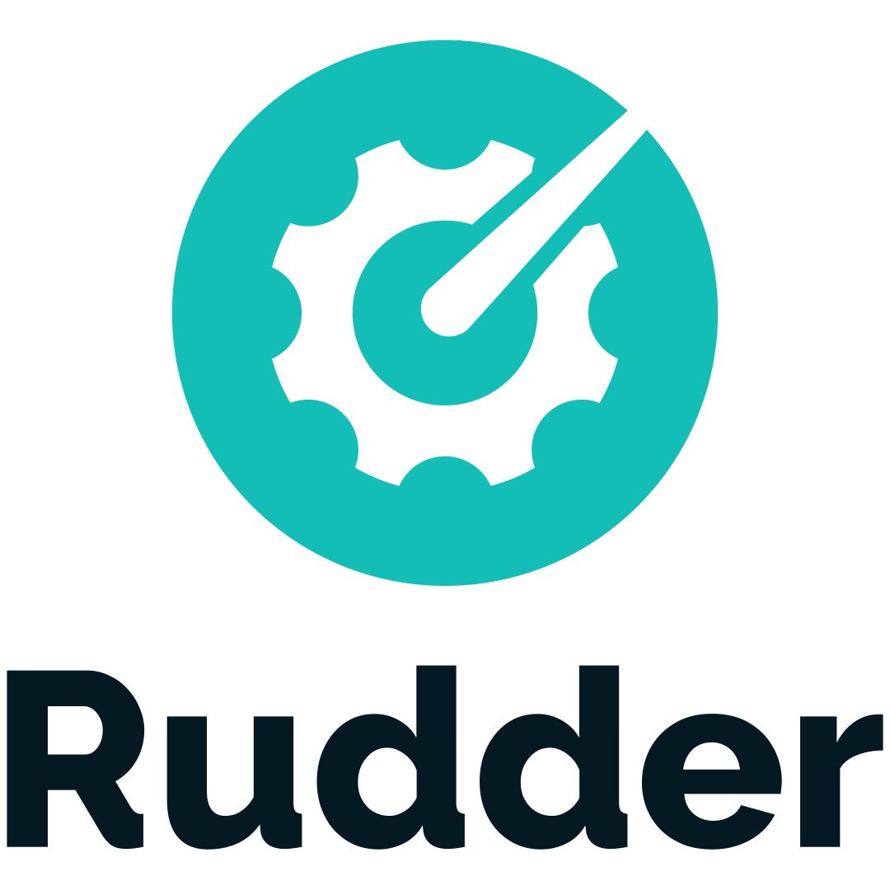
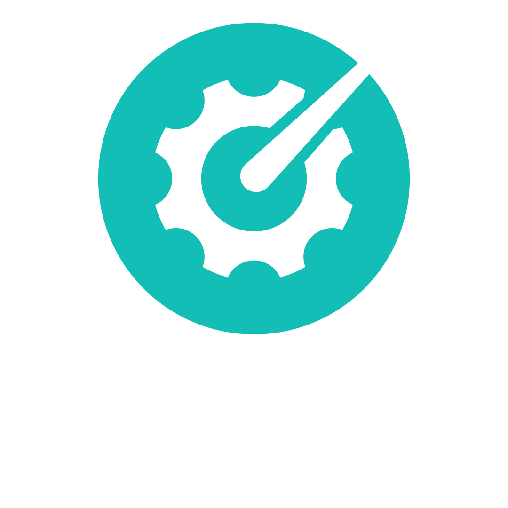
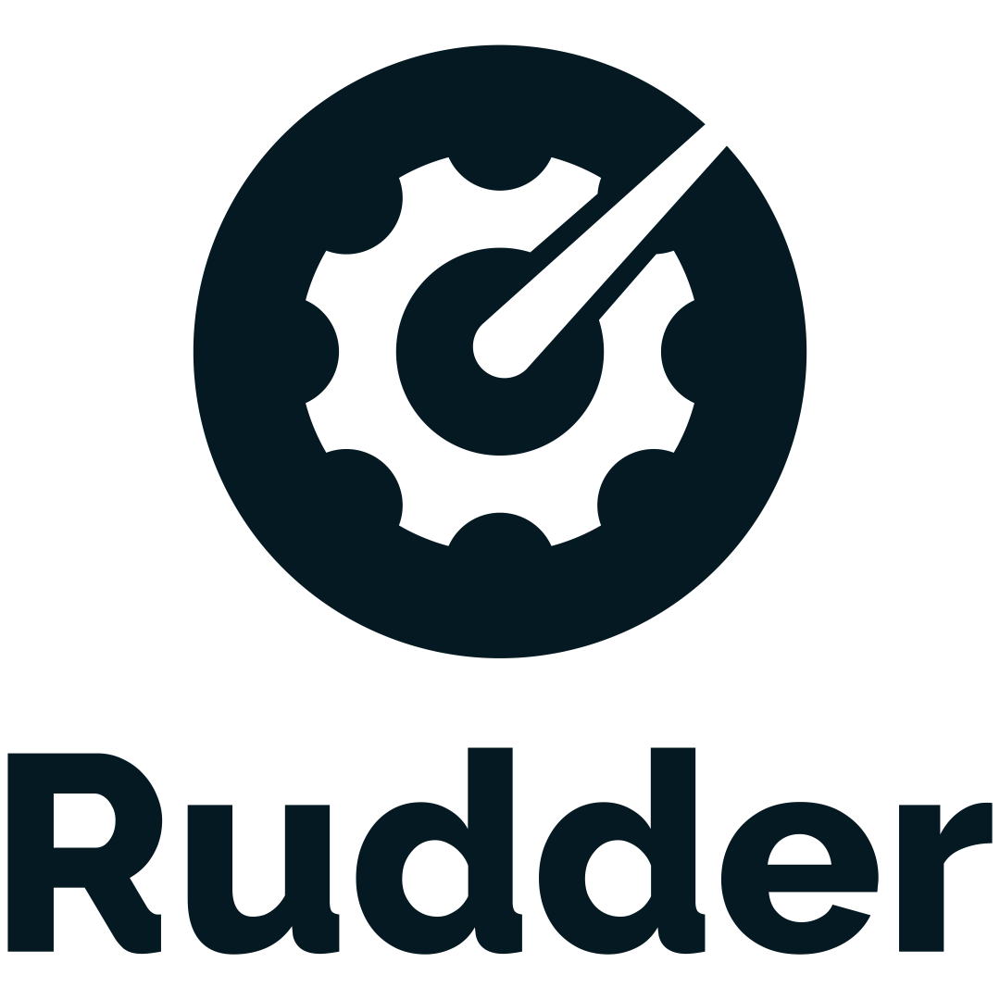
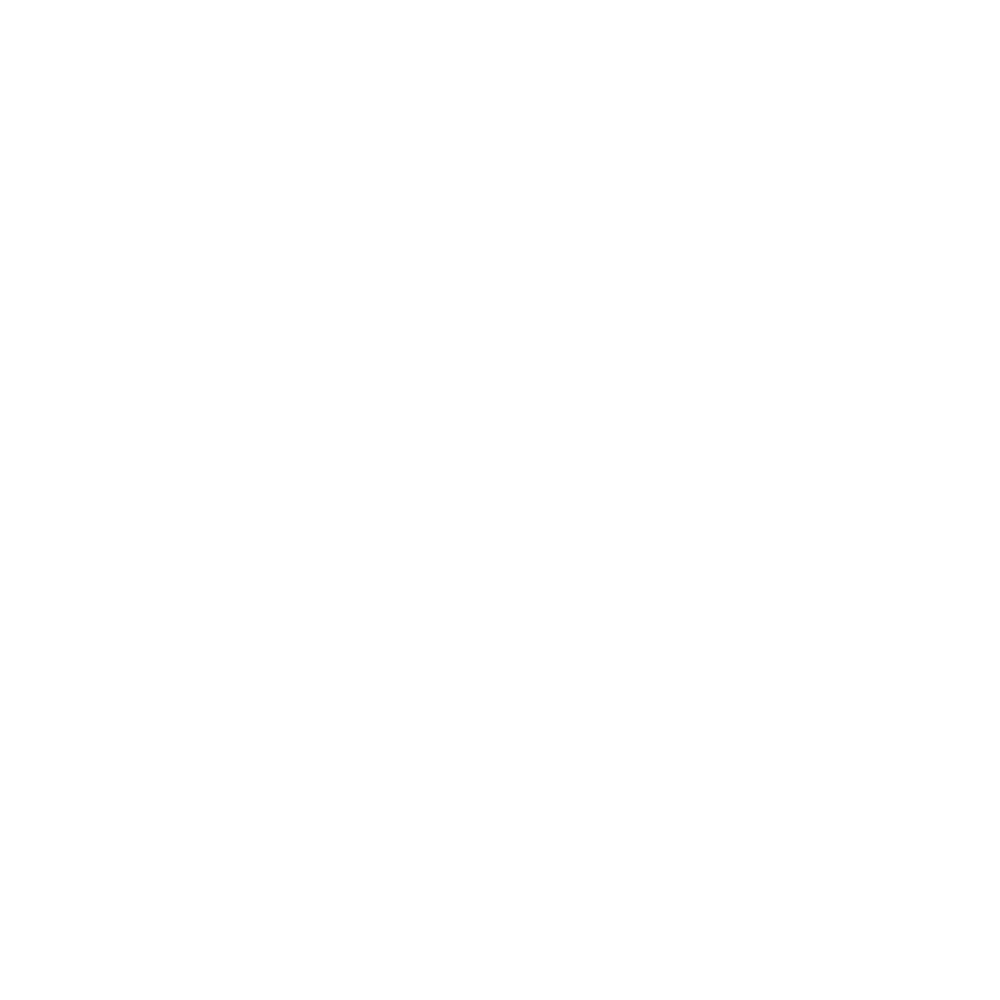

## Rudder Logos

<table>
    <tr>
        <th></th>
        <th>square</th>
        <th>horizontal</th>
    </tr>
    <tr>
        <th>black</th>
        <td></td>
        <td></td>
    </tr>
    <tr>
        <th>white</th>
        <td></td>
        <td></td>
    </tr>
    <tr>
        <th>monochrome black</th>
        <td></td>
        <td></td>
    </tr>
    <tr>
        <th>monochrome white</th>
        <td></td>
        <td></td>
    </tr>
    <tr>
        <th>no text</th>
        <td></td>
        <td></td>
    </tr>
</table>

### Build

The build the full set of icons (optimized SVG and PNG), use the `convert.sh` script.
