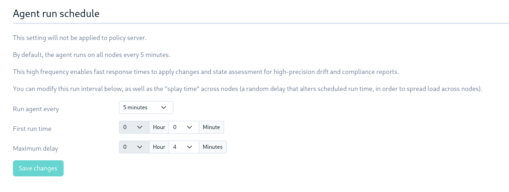
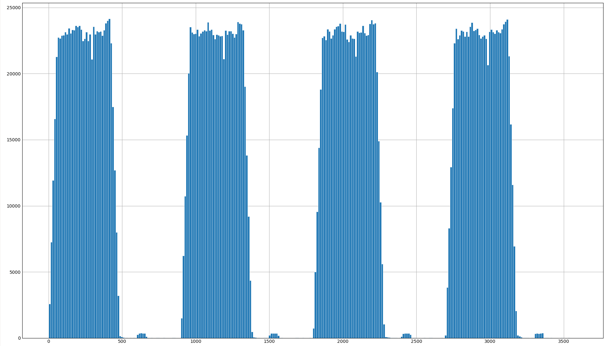
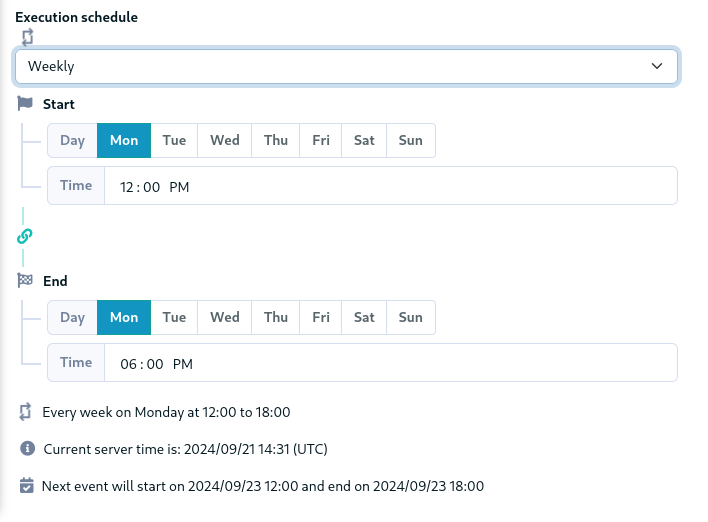

---
title: "Rudder agent schedulers"
#subtitle: "Extending the agent"
author: Alexis Mousset - Rudder
lang: en
region: US
#toc: true
papersize: a4
date: 2024-09-23
#bibliography:
#  - config-mgmt.bib
abstract: This document describes all the scheduling processes used for events happening on the agents, as of Rudder 8.1.7/8.2.0.

# Use link style & font from the nice "ilm" package
# https://github.com/talal/ilm/blob/main/lib.typ
mainfont: "Libertinus Serif"
header-includes: |
    ```{=typst}
    #show link: it => {
      it
      h(1.6pt)
      super(box(height: 3.8pt, circle(radius: 1.2pt, stroke: 0.7pt + rgb("#993333"))))
    }
    #set heading(numbering: "1.")
    ```
...

# Rudder agent schedulers

This document describes all the scheduling processes used for events happening on the agents. It does not cover events happening inside the server services (`webapp`, `relayd`, etc.). The main goal of these scheduling systems is to avoid running anything synchronously over the nodes, as it could result in performance impacts for the users. It also gives time to stop a change or action breaking the systems before everything is impacted. There are two types of schedulers: a main one triggering the agent, and others, inside the policies, that schedule events in specific agent runs.

## Agent schedulers

The Rudder agents are programs designed to be un regularly on a system. The agent scheduling configuration is done either globally or overridden by node, in the Web application. The parameters are:

* A run frequency, with a limited set of possible values:
    * 5, 10, 15, 20 or 30 minutes
    * 1, 2, 4 or 6 hours
* A splay time: a value that will be spread uniformly across the nodes, shorter that the run frequency to prevent overlapping runs.
    * Can take any value from `0 minutes` to `run_frequency - 1 minute`.
* A start time, providing the start point from the beginning of the day or the hour.
    * For example, a 10 minutes run schedule starting at 3 minutes will run at 3:03, 3:13, 3:23, etc.

They are exposed in the [settings API](https://docs.rudder.io/api/v/19/alt/#get-/settings) as:

* `run_frequency` (_integer_): Agent run schedule - time between agent runs (in minutes)
* `first_run_hour` (_integer_): First agent run time - hour
* `first_run_minute` (_integer_): First agent run time - minute
* `splay_time` (_integer_): Maximum delay after scheduled run time (random interval)

And in the Web interface:



Policy server (root and relays) are excluded from these settings' effect and use a hard-coded schedule, as they need to run frequently to ensure smooth operation of the Rudder infrastructure:

* _root server_: 5 minutes frequency, start at 0 minutes, 0 minutes of splay time
* _relay servers_:
    * Before 8.1.7/8.2.0 : like root servers
    * After 8.1.7/8.2.0: 5 minutes frequency, start at 2 minutes, 2 minutes of splay time

The values are exposed as generic system variables:

* `AGENT_RUN_INTERVAL`: a number in minutes, e.g. `5`
* `AGENT_RUN_SPLAYTIME` : a number in minutes, e.g. `4`

Plus additional variables targeting specific agents:

* `AGENT_RUN_SCHEDULE` (_Linux_): a list of CFEngine class expressions, represented as a string with comma separated values, e.g. `"Min00", "Min05", "Min10", "Min15", "Min20", "Min25", "Min30", "Min35", "Min40", "Min45", "Min50", "Min55"`
* `AGENT_RUN_STARTTIME` (_Windows_): a time of the day, e.g. `00:00:00`

See the following section for more details about how they are used by the agents.

### Windows agent run

The agent runs are scheduled using Windows' built-in task scheduler ("`taskschd`"). 

#### Splay computation

As the Windows scheduler does not provide stable splaying capabilities we use in Rudder, but only a completely random option, we create the splay as part of the policy generation in the Web application (in the `ComputeSchedule` object).

```scala
def computeSplayTime(nodeId: String, interval: Duration, maxSplaytime: Duration): Duration = {
  if (nodeId.isEmpty || maxSplaytime.isZero || interval.isZero) Duration.ofSeconds(0)
  else {
    val splay        = if (maxSplaytime.compareTo(interval) > 0) interval else maxSplaytime
    val bigInt       = BigInt.apply(nodeId.getBytes(StandardCharsets.UTF_8))
    val secondPerDay = 86400
    Duration.ofSeconds(bigInt.mod(splay.getSeconds).mod(secondPerDay).toLong)
  }
}
```

This function takes a max value for the splay which is actually the run frequency, to prevent outputting splay times longer that the run frequency.

#### Task configuration

The configuration format is specific for Windows, as it gets inserted into the task configuration directly. Note that we don't use the [newer PowerShell-based interface](https://learn.microsoft.com/en-us/powershell/module/scheduledtasks/?view=windowsserver2022-ps) as we require compatibility with older system, so we use the [XML-based interface](https://learn.microsoft.com/en-us/windows/win32/taskschd/taskschedulerschema-repetition-triggerbasetype-element). This excerpt is taken from `Rudder-Agent.xml.mustache`:

```xml
<Triggers>
  <TimeTrigger>
    <Repetition>
      <Interval>PT{{{vars.systemParams.AGENT_RUN_INTERVAL}}}M</Interval>
      <StopAtDurationEnd>false</StopAtDurationEnd>
    </Repetition>
    <StartBoundary>2017-05-19T{{{vars.systemParams.AGENT_RUN_STARTTIME}}}</StartBoundary>
    <ExecutionTimeLimit>PT2H</ExecutionTimeLimit>
    <Enabled>true</Enabled>
  </TimeTrigger>
</Triggers>
```

The important parameters:

* `Interval`: Specifies the amount of time between each restart of the task. The format for this string is `P<days>DT<hours>H<minutes>M<seconds>S` (for example, `PT5M` is 5 minutes, `PT1H` is 1 hour, and `PT20M` is 20 minutes). Here we pass directly the splay time in minutes.
* `StartBoundary`: The date and time when the trigger is activated. The date and time must be in the following format: `YYYY-MM-DDTHH:MM:SS(+-)HH:MM`. As our schedules are all shorter than a day, we hard code the start day in the task.
* `ExecutionTimeLimit`: Limits the agent run to 2 hours before killing the process.

As the `StartBoundary` is templated from system variables, we need to compute the start time plus splay time on the server, and format it as the expected `hh:mm:ss` for the start time:

```scala
def getSplayedStartTime(nodeId: String, startTime: LocalTime, interval: Duration, maxSplaytime: Duration): LocalTime = {
  startTime.plus(computeSplayTime(nodeId, interval, maxSplaytime))
}

def formatStartTime(startTime: LocalTime): String = {
  // the withNano(0) is to only print "hh:mm:ss", not "hh:mm:ss.sss"
  startTime.withNano(0).format(DateTimeFormatter.ISO_TIME)
}
```

#### Inventory scheduling

```xml
<Triggers>
  <CalendarTrigger>
    <StartBoundary>2017-06-14T00:00:38</StartBoundary>
    <ExecutionTimeLimit>PT2H</ExecutionTimeLimit>
    <Enabled>true</Enabled>
    <RandomDelay>PT2H</RandomDelay>
    <ScheduleByDay>
      <DaysInterval>1</DaysInterval>
    </ScheduleByDay>
  </CalendarTrigger>
</Triggers>
```

This task uses a different type of scheduling, with a daily run using a `CalendarTrigger`, and:

* `StartBoundary`: As the task runs daily, we can use a completely hard coded value. To mimic the Linux behavior, the inventory process starts at (actually a bit after) midnight.
* `ExecutionTimeLimit`: this is the maximal run time before the task is killed. For the inventory, this value is 2 hours.
* `RandomDelay`: The delay time that is randomly added to the start time of the trigger. The format for this string is the same as the `RepetitionInterval`. It is actually a number chosen independently at each trigger, and not stable in time like the usual Rudder splay. Here its value is 2 hours which means the inventories run between midnight and 2 a.m., while Linux inventories run between midnight and 6 a.m.

### Linux agent run

The Linux agent is scheduled by the `cf-execd` daemon, part of CFEngine (named `rudder-cf-execd` in Rudder), run as a system service (usually via systemd). It runs in background, and wakes up every minute to check if the agent should be triggered. It follows scheduling parameters present in the policies themselves. The sources of the `promises.st` file of the Linux agent contain:

```
body executor control {
        schedule  => { &AGENT_RUN_SCHEDULE& };
        splaytime => "&AGENT_RUN_SPLAYTIME&";
        exec_command => "/opt/rudder/bin/rudder agent run -uRN";
}
```


* `schedule`: The list should contain class expressions comprised of classes which are visible to the `cf-execd` daemon. In principle, any defined class expression will cause the daemon to wake up and schedule the execution of the `cf-agent`). In practice, the classes listed in the list are usually date- and time-based.
    * A general rule for scaling of small updates is to set the splay time to `run interval-1 minutes` for up a few thousand hosts. The `splaytime` should be set to a value less than the `cf-execd` scheduling interval, else multiple clients might contend for data.
    * The actual execution of `cf-agent` may be delayed by `splaytime`, and may be deferred by promise caching and the value of `ifelapsed`.
* `splaytime`: Time in minutes to splay this host over. The actual execution will be delayed an integer number of seconds between 0 and `splaytime` minutes. The specific amount of delay for "this" host is based on a hash of the hostname. Thus, a collection of hosts will all execute at different times, and surges in network traffic can be avoided.
* The `exec_command` does not include any delay and runs the agent immediately through the shell wrapper. The `ifelapsed` valued are ignored since the wrapper uses the `-K` option to ignore locks.

With a 15 minutes frequency and a 7 minutes splay, the Web application generates:

```
body executor control {
        splaytime => "7";
        schedule  => { "Min00", "Min15", "Min30", "Min45" };
}
```

The schedule class expressions list is generated directly in the CFEngine syntax in the Web application (in the `ComputeSchedule` object), and templated into `promises.cf`. It generates the list of `MinXX` or `HrXX.MinYY` classes with the required start and frequency, depending if the schedule is expressed in minutes or hours.

The `cf-execd` daemon is responsible for computing the local splay value, based on system information and the maximum value provided in the policies. The splay uses the system's hostname as seen by the kernel, its IP (resolved from hostname) and the current user ID (in Rudder, always 0), to provide a stable value, then hashes these to get a uniform distribution. The hash function used is [Jenkins' one-at-a-time](https://en.wikipedia.org/wiki/Jenkins_hash_function#one-at-a-time), which is enough to provide uniformity (and we don't ask for more).

```c
// returns a value in [0, 1)
static double GetSplay(void) {
    char splay[CF_BUFSIZE];
    snprintf(splay, CF_BUFSIZE, "%s+%s+%ju", VFQNAME, VIPADDRESS, (uintmax_t)getuid());
    return ((double) MIN(StringHash(splay, 0), UINT_MAX - 1)) / UINT_MAX;
}

ExecdConfig *ExecdConfigNew(int configured_splaytime) {
// ...
   int splay = (int) (configured_splaytime * SECONDS_PER_MINUTE * GetSplay());
// ...
}
```

`cf-execd` works at the minute resolution. It wakes in the first seconds of each minute to check for schedule classes, and run the agent if needed. In this case the agent is run in a separate thread and does not impact the scheduling. When waking at a scheduled minute, `cf-execd` will wait for the computed splay in seconds before actually running the agent.

Below is an example of the agent start times over an hour (3600 seconds) on a big Rudder instance. The nodes have a 15 minutes schedule with a 7 minutes splay time, and there are tens of relays. We can see the 5 minutes schedule of the relays and root server, plus the 15 minutes schedule of the nodes uniformly splayed over 7 minutes.



To help users understand and debug the agent, we added the planned time of the next agent run in `rudder agent info` output:

```
Run interval: 5 min
Next run: 2024-09-23 10:18:04+0200
```

This time is based on a re-computation of `cf-execd`'s splay time, starting in the agent policies to dump dme values:

```cfengine
      "inventory_splay_hex" string => string_head(hash("${sys.host}", "md5"), "7");
      "executor_data"       string => execresult("printf '${sys.fqhost}+${sys.ipv4}+0\n${sys.systime}\n&AGENT_RUN_SPLAYTIME&\n${agent_run_interval}\n${inventory_splay_hex}\n' > /var/rudder/tmp/cf-execd.data ", "useshell");
```

Then the `rudder agent info` calls a Perl script, `get-splay.pl`, that simulates the computations done in `cf-execd` to then display a time for the user:

```bash
splays=$(/opt/rudder/bin/rudder-perl /opt/rudder/share/lib/get-splay.pl)
if [ "${splays}" != "" ];then
  RUN_TIME=$(date -d "+${splays% *} seconds" +"${DATE_FORMAT}")
  INVENTORY_TIME=$(date -d "$(LANG=C date -I) +${splays#* } seconds" +"${DATE_FORMAT}")
fi
```

#### [Bug 25505](https://issues.rudder.io/issues/25505) - 2024-09-20
There was a change in the `cf-execd` scheduling in Rudder 8.1.7 and 8.2.0 to fix a bug (CFEngine commit [fa6474c](https://github.com/cfengine/core/commit/fa6474c3f8495258ba16eeb701895ff73858a637)) that made around 0.1% of agent runs being skipped. It was discovered on a customer's large Rudder instance, so we back-ported the fix to 8.1.
The problem was that the target resolution of `cf-execd` being one minute, the main loop would wait exactly one minute between checks. When starting very close to the beginning or the end of a minute, the 60 seconds sleep could make the schedule check totally skip one specific minute, hence skipping a run in some cases.
The exact second the check was done was drifting over time, producing a random skip pattern. With the fix, the daemon sleeps for the amount of seconds until the beginning of every minute (around mm:02), which prevents skipping a minute. But without this "poor man's splay" of one minute, all the relays would now trigger at the exact same time, with a risk of overloading the root server (or an underlying hypervisor). We hence decided to also add a 2 minutes splay to relays, and add a 1-minute shift of start time, which is also likely a good idea regardless of the bug fix.

#### Inventory scheduling

The inventory is scheduled inside the policies, using the `schedule_simple` method described below. It hence relies on the agent schedule as primary "heartbeat". We also choose to run an inventory each day, even if the agent starts for the first time after 6 a.m. ("catch-up" mode).

```cfengine
schedule_simple(# Frequency of the agent runs, required to compute the target schedule
                "&AGENT_RUN_INTERVAL&",
                # Starting at midnight, over 6 hours, every "1" day
                "0", "6", "0", "0", "0", "0", "0", "1",
                # If missed due to skipped agent runs, run it even after the end of the window
                "catchup");
```

#### Agent check scheduler

To provide a fallback mechanism in case `cf-execd` fails to run the agent, we also set up a cron job responsible from triggering the agent. It tries to follow the run schedule with some awk-based computations to avoid causing problems when it needs to run agents.

```cfengine
bundle agent setup_cronjob
{
  vars:
    in_hours::
      "interval_str" string => eval("${system_common.agent_run_interval} / 60", "math", "infix");
      "interval" string => format("%d", "${interval_str}");
      "steps" string => execresult("echo '0 23' | ${paths.awk} '{ for (i=$1;i<=$2;i=i+${interval}) { printf \"%s%s\", sep, i; sep=\",\"}} END{print \"\"}'", "useshell");
      "cron_prefix" string => "0 ${steps} * * *";

    !in_hours::
      "steps" string => execresult("echo '0 59' | ${paths.awk} '{ for (i=$1;i<=$2;i=i+${system_common.agent_run_interval}) { printf \"%s%s\", sep, i; sep=\",\"}} END{print \"\"}'", "useshell");
      "cron_prefix" string => "${steps} * * * *";
#...
}
```

and the cron script template contains something along the lines of:

```
{{{vars.setup_cronjob.cron_prefix}}} root /opt/rudder/bin/rudder agent check -q >> /var/log/rudder/agent-check/check.log 2>&1
```

On a system with a 5 minutes schedule, it gives:

```
0,5,10,15,20,25,30,35,40,45,50,55 * * * * root /opt/rudder/bin/rudder agent check -q >> /var/log/rudder/agent-check/check.log 2>&1
```

In addition to this, the `rudder agent check` command, when started in non-interactive mode, adds a sleep to model a time splaying. This is a purely random splay, with a maximal value of half the run frequency, not stable between calls.

```bash
MAX_SLEEP=`expr ${AGENT_RUN_INTERVAL} \* 30` # in second
SLEEP_DURATION=$(awk -v m="$MAX_SLEEP" 'BEGIN{srand(); print int(rand()*m)}')
sleep $SLEEP_DURATION
```

## In-policies schedulers

These "secondary" schedulers rely on the regular agent runs to wake the scheduler up and allow triggering actions. They are hence limited to the agent run frequency resolution.

### System update campaigns

The campaign scheduling parameters are defined as part of the campaign:



The main scheduling work (recurrence, overlapping, etc.) is done by a dedicated campaign scheduler in the web application. It outputs a time window for each campaign event (translated as a directive), with a start and an end timestamp. The local scheduler is then only responsible for splaying the upgrades across the whole time windows.

The campaign module, both on Linux and Windows, use a similar method for scheduling the upgrade. The campaign takes a time windows (start and end timestamps), the agent run frequency, and the node ID. It is then responsible for choosing a local start timestamp, based on the node ID uniqueness and agent run frequency.
The actual end date for the scheduler is not the end of the window, as we want to make reasonable effort to avoid having upgrades finishing after the end of the window. Given the amount of time taken by system upgrades, and the opposite need to allow small windows, we settled on 5 minutes + one agent schedule period. The agent schedule allows avoiding missing the upgrade if the schedule ends up close to the end of the window.
The node ID is used to uniformly splay the upgrades across nodes. To avoid relying on the assumption the node ID are uniform (they are unique but depending on the UUID types and method of generation they may not be uniformly distributed), we add a simple hash ([FNV](https://en.wikipedia.org/wiki/Fowler%E2%80%93Noll%E2%80%93Vo_hash_function) on Linux, [MD5](https://en.wikipedia.org/wiki/MD5) on Windows) to ensure uniformity of the scheduling.

Implementation in the Linux module:

```rust
pub fn splayed_start(
    start: DateTime<Utc>,
    end: DateTime<Utc>,
    agent_schedule: Duration,
    unique_value: &str,
) -> Result<DateTime<Utc>> {
    let mut hasher = FnvHasher::default();
    hasher.write(unique_value.as_bytes());
    let hash = hasher.finish();

    let real_end = end - (agent_schedule + Duration::minutes(5));
    if real_end <= start {
        // error
    }
    let splay = Duration::seconds((hash % (real_end - start).to_std()?.as_secs()) as i64);
    let real_start = start + splay;
    Ok(real_start)
}
```

In the Windows technique:

```powershell
function Get-SplayedStart {
  param(
    $startDate,
    $endDate,
    $nodeId,
    $agentSchedule
  )
  $md5 = New-Object -TypeName System.Security.Cryptography.MD5CryptoServiceProvider
  $ascii = New-Object -TypeName System.Text.ASCIIEncoding
  $hash = ([System.BitConverter]::ToString($md5.ComputeHash($ascii.GetBytes($nodeId)))).ToLower() -replace '-', ''
  $splay = ConvertFrom-Hexadecimal -hexadecimal ('{0:X}' -f $hash)
  $realEnd = $endDate.AddSeconds(-$agentSchedule * 60).AddSeconds(-5 * 60)
  if ($realEnd -le $startDate) {
    # Error
  }
  $delay = $splay % ((ConvertTo-UnixTimeStamp -Date $realEnd)- (ConvertTo-UnixTimeStamp -Date $startDate))
  $realStart = $startDate.AddSeconds($delay)
  return $realStart
}
```

As the server does not know when an event is scheduled, the campaigns API provide a special type of report for the nodes to inform the server about the chosen start date, containing a RFC3339-formatted UTC timestamp:

```rust
let schedule_datetime = match schedule {
    FullSchedule::Immediate => Utc::now(),
    FullSchedule::Scheduled(ref s) => {
        scheduler::splayed_start(s.start, s.end, s.agent_frequency, s.node_id.as_str())?
    }
};
// ...
let report = ScheduleReport::new(schedule_datetime);
```

### In the Linux policies

The method library provides a few way for scheduling events part of the policies, only on Linux:

* [`schedule_simple`](https://docs.rudder.io/techniques/8.1/schedule_simple.html) is used for Rudder inventory scheduling
* [`schedule_simple_catchup`](https://docs.rudder.io/techniques/8.1/schedule_simple_catchup.html)
* [`schedule_simple_nodups`](https://docs.rudder.io/techniques/8.1/schedule_simple_nodups.html)
* [`schedule_simple_stateless`](https://docs.rudder.io/techniques/8.1/schedule_simple_stateless.html)

The implementation is based on the "time library", which is written in pure CFEngine (probably one of the worst languages to express these calculations). The splaying is achieved based on a `sha256(${sys.host})`, which means hosts sharing the same hostname (short, from the kernel) will share the same schedule with identical parameters.

```cfengine
bundle agent ncf_splay {
  vars:
    # maximum value of splay integer = 7 nibbles (2^28-1)
    "splay_max" string => "268435455";
    # pseudorandon deterministic hex number of 7 nibbles
    "splay_hex" string => string_head(hash("${sys.host}", "sha256"), "7");
    # decimal version of the splay integer
    "splay" string => execresult("/usr/bin/printf '%d' 0x${splay_hex}", "noshell");
}
```

## System schedulers

### `systemd.timer`

The [scheduling features of systemd](https://www.freedesktop.org/software/systemd/man/latest/systemd.timer.html) could match most of our needs. However, it would only support a (large) subset of our Linux agent target (not the old versions or non-systemd based distributions).

* There are two types of schedules:
  * `OnActiveSec`, `OnBootSec`, etc.: These are monotonic timers, independent of wall-clock time and timezones.
  * `OnCalendar`: Defines realtime (i.e. wallclock) timers with calendar event expressions.
* `RandomizedDelaySec`: Delay the timer by a randomly selected, evenly distributed amount of time between 0 and the specified time value.
* `FixedRandomDelay`: Takes a boolean argument. When enabled, the randomized offset specified by `RandomizedDelaySec=` is reused for all firings of the same timer. For a given timer unit, the offset depends on the machine ID, user identifier and timer name. The machine ID works like the Rudder node ID (i.e. a UUID unique to each system).
* `AccuracySec`: The resolution of the scheduler, by default 1 minute to optimize power consumption. Within this time window, the expiry time will be placed at a host-specific, randomized, but stable position that is synchronized between all local timer units.
* `Persistent`: persists the latest run time to allow catching up if the calendar target was missed.

### `cron`

`cron` does not have built-in features for splaying commands and only supports calendar-based schedules. However, it can be extended using shell wrappers around the commands.

## Conclusion

The different agent scheduling systems are quite inconsistent, but seem to work well enough to cover our current needs.

### Simple improvements

* The computation of next inventory schedule is wrong as the hash used in the time lib was changed from md5 to sha256. This confirms this implementation is very fragile.
* Splay the Windows inventories on a longer duration, and maybe make it stable too. Currently, they run between midnight and 2 a.m, at a different time each day.
* Add a uniform hash to the Windows agent splay to only require ID uniqueness and not uniformity (which could not be the case in case of custom ID generation for example).
* Use more uniqueness than the hostname for the scheduler methods and the Windows splay, as it could become an issue when running on cloned systems.
* Replace the usage of MD5 in the Windows system upgrade technique. While it is only used for its output uniformity (and is not a security issue) it is flagged by security code scanners and might also be unavailable on FIPS-enabled systems.
* The cron fallback on Linux could be replaced by a systemd timer in most cases, with a simpler and likely more reliable configuration.

### Other topics

We should decide if we actually want to keep agent scheduling local, or if we want the server to decide everything centrally. The Windows agent run splay could easily be implemented as part of the F# library for example, and the Linux splaying could be implemented on the server as well.

There is also a topic about time representations (including time zones), which are not consistently handled in Rudder. For anything happening inside Rudder (and not related to the user's systems), using UTC times everywhere, with RFC3339 formatting when serialized as string, is probably the best option. For an introduction to why time is a really hard problem, read the excellent "[UTC is enough for everyone ...right?](https://zachholman.com/talk/utc-is-enough-for-everyone-right)" page (by Zach Holman).

Finally, we have a project of writing a `cf-execd`-like daemon in Rust that would also replace the remote trigger feature of `cf-serverd` and could be used both on the Linux and Windows agent, which currently does not support remote run. This could allow making all agent-side schedulers more consistent, with an API fitting our needs.

