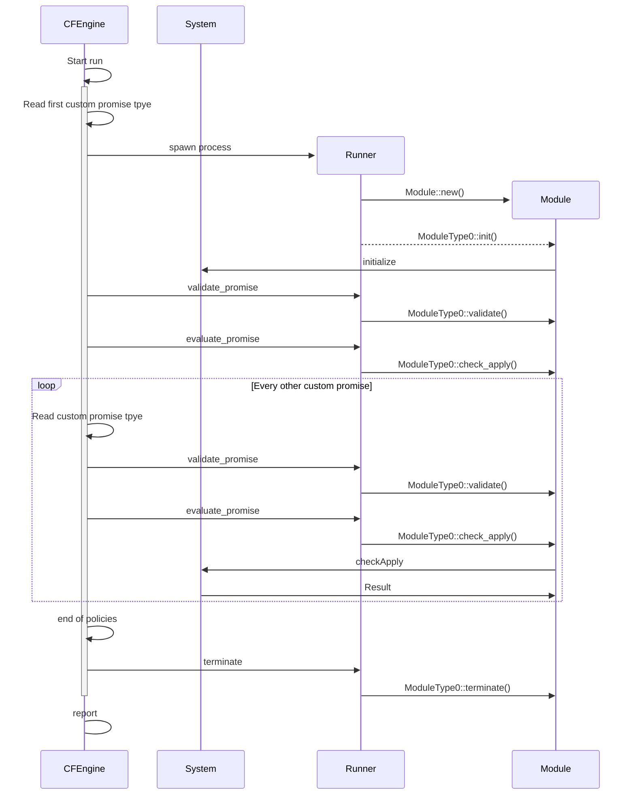

---
title: "Rudder modules"
author: Alexis Mousset
bibliography:
  - modules.bib
url: https://github.com/Normation/rudder/tree/master/policies/arch-doc/modules
abstract: Configuration management primitives appear like a solved topic now, and current major solutions have converged to pretty similar choices 10+ years ago. However, new needs are becoming more prominent, like observability, auditing and self-auditing abilities, in a context of growing attention for security topics. Could we benefit from reconsidering some of these design choices now to better address them? We will navigate through the solution space of configuration management low-level implementations (resource/promise/etc.), and explore what we can modify to provide new promising features. It will also cover implementation and programming language choices, from C to Python, Ruby, and Rust, and how these choices participate in shaping our tools strengths and weaknesses. It will feature some examples from ongoing work in Rudder, as well as other projects (mgmt, Jet, etc.)
...

# Introduction

Since a few years, Rudder has taken an important shift towards security
posture management. This includes, more specifically, audit features around
security benchmarks and norms, still based on the configuration
management core.

While implementing these features, we reached several limits. The first one is
related to the audit capabilities. Even if Rudder has officially integrated audit features for almost ten years, it is
limited by nature, and shows it shortcomings
in security benchmark audit.
Additionally, we also lack capabilities for richer reporting to the user
in these contexts, where the data collected from the policies is not
a byproduct useful for debugging, but the main output.

All this calls for new approaches and feature on agent level.
However, the story for core resource extension is not great, especially on Linux.
We will hence need new extension mechanisms to achieve our goals.

The capabilities we need are not currently available in any existing tool, so we will
need to develop it ourselves.
This will also help us improve existing cases, and replace some existing extensions.

To sum things up we need:

* A new extensibility mechanism for our Linux agent that must also allow
  Windows support in the future to allow a more unified approach.
* Extensions to what the agent can do, to support new needs like pure-audit cases in the short term.
* Extensions in how the agent works, to allow for improved reporting and observability
  eventually.

All of this to make our primitives capable of providing best-in-class security posture
management features in Rudder.

We will start by discussing the current state of the art, and the choices that need to be made
when implementing such resources.
We'll cover standard implementations (CFEngine, Puppet, Ansible, etc.), more recent ones
(DSCv3, mgmt) and other closely related domains.

We'll then cover the design of the **Rudder modules** and the choices we made for them.
We'll finish by illustrating it with implementation details of the first two
module type, system-updates and augeas.

# Problem space

## Configuration management

DevOps / Automation

computer immunology
Promise theory

Which interface do we use on the Linux systems?

Unix v7, really

(actually \~ POSIX)

The only stable interoperable interface (usually not the C API
because...)

Late 70s

We'll study higher level interfaces and see why they (always?) fail.

And yes even the shiny containers are made of intricate shell scripts.

The Unix programming interface

- ~~C~~ (too difficult)

- Text interfaces

- Commands (in shells)

- Maybe even sockets

- *Everything is a file*

- That's (pretty much) it!

Since Unix 7

- More orientation towards declarative configuration and data

    - init scripts -\> systemd units

    - dedicated configuration languages -\> YAML/JSON/TOML/etc.

- Libraries

    - `systemd`

    - package managers

  systemd is in a way a big change, better for config mgmt


- All CM tools parse commands outputs with regexes and a lot of
  special cases

    - The internals are usually messy

- Hides this pretty successfully from the user

    - But the abstractions are leaky

  The rug under which we hide terrible stuff

  use this commands except if version \< X except if version == Y
  because

- Could have Cfg Mgmt provided an interoperable and reusable higher
  level interface as a commodity?

L'idéal de la gestion de conf qui map tout (fichier de conf, etc)
Réalité : la partie commune est assez fine La partie complexe n'est pas
généralisable et demande de la connaissance Le problème n'est pas le
format du fichier de conf.

explique l'échec ? tentative d'abstraction douteuse ?

### Configuration surface of a Linux system

- A kernel, including a lot of runtime config

    - 1629 values in `sysctl`

    - `nftables` rules

    - eBPF programs

- A file system

- States everywhere

## Audit

Tools and frameworks for compliance automation such as OpenSCAP, Chef InSpec, and CIS-CAT.

mixing audit and enforce is tricky
why?

Nobody has _really_ tried to make an audit & enforce tool.
Msotly for business reasons.
We are trying to achieve it now.

Separation of duty, different teams

a certain value to this separation (if something is not crrectly seen in enforce, aidit will miss it!)

the declarative model doesn't give you any real visibility to the \*true\* state of the resource.
It gives you fantastic visibility into your \*intended\* state, but basically zero into reality.

cfgmgmt is a one way street. le réel ne marche pas comme ça.

And to make it worse, even if it showed you reality, you have no ability to influence the behavior anyway - because
that's the job of the reconciliation loop! You get what you get, and you don't throw a fit, in space and in time.
Which is exactly what the \*intent\* behind changing the VPC declaration on day two was in the first place. We record
that intent in a change set, and we're constantly updating that change set as changes to the infrastructure flow by.
Rather than saying "this is the state this should be in, do whatever you must to make it so", we can say "here is the
state things are in. here is what the changes you want to make would produce if you made them", and let you decide to
execute on that intent.

On veut:

* voir ce qui ne va pas
* décider de comment le corriger (ou pas)

## Immutable infrastructure

Cloud does not mean immutable.

ON NE PEUT PAS IGNORER LE REEL

la seule façon de changer un truc est de repasssr dans l'usine à suacisse (et de changer la recette, build image/CIC/CD)
congruence vs convergence

changement permanent et maitrisé -\> quand on rebuild un conteneur on ne
maitrise pas le diff

opacité de l'immutables EST un problème

Nix
Un modèle mais avec de grosses contraintes
controled mutability has its perks

immutable : doit être audité, la surface d'attaque n'est pas nécéssairement plus petite.

- Immutable infrastructure

    - Dockerfiles are shell scripts

    - Trading flexibility and power for simplicity

So there was a moment in Chef’s life where - you know, Docker had happened, and Docker was so disruptive to us and to
everyone in that space… And there was a minute where they were just – you couldn’t have a conversation that wasn’t just
Docker, Docker, Docker, Docker, Docker, Docker, Docker. And with our own investors, our customers, they were like “You
guys are dead, right?” It was awful.

- The infrastructures are not immutables

    - A way to model changes

    - Move the mutation to a higher abstraction layer

- Mutability is light and fast

- Immutable means frozen, not understood and observable

- Parallel with programming language?

    - Mutability is a major source of bugs

    - Immutability is a way to prevent them

    - Most programs are written with mutability eveywhere

- E.g. Rust aims at managing mutability better instead of preventing
  it

## API management

Cloud

audit d'api http : un domaine à part
(pulumi, terraform).
maintenance d'état over HTTP

=> pas notre domaine, sisteminitiative très intéressant sur ces sujets.
notamment capacités de modélisation. des choses à apprendre.

## Patch management

## Vulnerability management

A complete

# Prior art & solution space

The tools we will mention here besides Rudder are:

- [CFEngine](https://cfengine.com): the oldest of the bunch, and the one that started the
  configuration management trend in 1993.
- [Puppet](https://www.puppet.com/): CFEngine's successor in a way. Probably the best industrialized solution.
- [Chef Automate](https://community.chef.io/): Puppet's competitor, with a more developer-oriented approach.
- [Chef InSpec](https://community.chef.io/tools/chef-inspec): a compliance tool developed by Chef.
- [OpenSCAP](https://www.open-scap.org/): a compliance tool developed by Red Hat.
- [Ansible](https://www.redhat.com/en/ansible-collaborative): The current leader in the field, with a simpler approach.
- [SaltStack](https://www.saltstack.com/): A more event-driven approach.
- [DSCv3](https://learn.microsoft.com/en-us/powershell/dsc/overview?view=dsc-3.0): The new version of Desired State
  Configuration in Windows.

    - Multiplatform (Windows, macOS, Linux)

    - Open-source

    - No dependency on Powershell

    - Resources can be written in any language

    - JSON instead of MOF

    - YAML policies

- [mgmt](https://mgmtconfig.com): A new configuration management tool, event-based.
- [Jet](https://web.archive.org/web/20240314161735/https://jetporch.org/): A quickly stopped project.

## Inventory / Facts

- [Facter](https://puppet.com/docs/facter/latest/facter.html): Puppet's inventory tool.

Two approaches:

- Inventory tools

    - Facter, Ansible facts, etc.
    - Inventory a la rudder

## Agent/Agentless

The most visible difference.

- What is *actually* the difference?

- There is always a kind of agent when the software runs

    - It can be copied over SSH and removed afterwards
- At low level, no difference
    - Mainly the presence of a long running process on the system
    - Push/pull

this may be how certain agent-based software implemented agentless...
but i won't give any names.

## Code vs. Data / Imperative vs. Declarative

- Configuration data can be declarative or a program
    - Not different at the lowest level
    - the resources are implemented in the same way

lib vs DSL, un cycle

If there wasn’t for Chef, there’d be no Pulumi. Right? There’d be no CDK. Those ideas of “You should do the automation
in a real programming language…”
Chef was the first of those, really, that wasn’t just writing scripts, you know? But it all stands on each other.

## Language for implementation

- Properties given by the tech stack

    - Fast, Portable, Beginner-friendly, etc.

- Values carried with the tech stack

    - Attracts different people

    - Participates to shape the community

@cantrillPlatformReflectionValues2017

- Write the resources in language used for the policies

    - Better for "dev-oriented" users

    - Flexibility

- Use data format or a DSL, and a different language for resources

    - Hides the complexity

    - Can limit user ability to hack the system

### Language in infra software

The first generating on configuration management software was written in C, as it was
common in the 1990s:

- C: CFEngine.

Interpreted languages were then the norm for a long time:

- Ruby: The second generation after CFEngine, Puppet and Chef
- Python: The third generation, Ansible and SaltStack

Compiled languages are now making a comeback:

- C++: Puppet's facter 3, rewritten from Ruby. It ended up being re-re-written in Ruby eventually, as the project of
  porting the agent to C++ was abandoned.
    - Core in C++ and everything else in Ruby. Bad idea?
    - We're considering doing the opposite, with Rust for leaves.
- Go: mgmt
- Rust: DSCv3, Jet

C is terrible security-wise high privilege + networking + C = problems
python has really low entry cost
ruby is for developers looking for a certain esthetics

Rust/C++ slow to evolve but fast
I think Rust makes sense for infra automatio today
with the main drawback of making it harder to contribute

### Impact

- System administrators are not developers

- Some languages are oriented towards for software developers

- Prevents extension by users

- *Worse is better*?

## Autonomous vs. imperative

## Types or strings everywhere / Static vs. dynamic

shifting problems left

Eliminate
possible errors early ("0x755" vs "755" vs decimal "755" vs o755 vs
"o755")

## Engine

- Config Mgmgt = an engine passing parameters to resources providers


- Handles data management

    - Load properties

    - String substitution

    - Out of scope here

- Calls the resources

- Usually a big `checkApply`

    - A stack structure usually

    - A graph sometimes?

idenpotency

- Idempotency building block
- State is a global variable
- This is what infra automation is all about

``` python
def checkApply():
    if is_ok(state):
        do_nothing()
    else:
        fix(state)
```

  ``` python
  def checkApply(audit):
       if is_ok(state):
         do_nothing()
       else:
         if audit:
           error()
         else:
           fix(state)
  ```

interleaved with resources

reactive vs imperative

graph vs sequence

## Extensibility / Resource API

Puppet has resource type vs. provider.

- Hardcoded resources may be hard to add

- Extension APIs

- Sometimes a "language" version (library) and a "data" version (YAML,
  etc.)

### Rudder

When we don't use the native CFEngine (on Unix) or DSC (on Powershell)
resource implementation we rely on:

- Powershell scripting on Windows

- CFEngine implementations in methods

    - pass hell

    - not thought for this (i.e. bundles retain data)

- External scripts

    - Python for jinja2 with a CFEgine wrapper

These are far from ideal.

### CFEngine

**Promises**

```cfengine
# promise type
files:
  # promiser
  "/etc/passwd"
    # attributes
    create => true,
    perms  => mog("664");
```

CFEngine is based on the notion of promises, which are kind of resource
types. A promise is made of:

- A type, which points to the implementation of a specific type of
  items

- A promiser, i.e. the item we act upon

- Attributes, describing the state we want the item to be in. Some
  attributes are scalar, some are made of bodies which are a reusable
  set of attributes.

Promises are then grouped in bundles, which can also call other bundles.
The logic for conditional evaluation is based on classes.

CFEngine 3.17 introduced the concept of [custom promise
type](https://docs.cfengine.com/docs/3.19/reference-promise-types-custom.html),
allowing to implement new resource types with a standard interface, and
use it like a native one on the policies.

``` cfengine
promise agent custom
{
  path => "/usr/local/bin/custom_implementation";
}

bundle agent main {
  custom:
    "mypromiser"
      attribute1 => "value1";
}
```

The protocol is JSON-based, and uses stdin/stdout to communicate with
the process implementing the promise type.

``` json
{ "operation": "evaluate_promise",
  "log_level": "info",
  "promise_type": "git",
  "promiser": "/opt/cfengine/masterfiles",
  "attributes": {"repo": "https://github.com/cfengine/masterfiles"} }
```

The performance of these extended resources should be close to native as
the process is spawned lazily at first usage and kept until the end of
the agent run. Note that the protocol is strictly synchronous and
sequential and no pipelining is possible.

### mgmt

mgmt is the newest configuration management agent implementation and is
the only event-based configuration management agent.

``` mgmt
import "datetime"
$is_friday = datetime.weekday(datetime.now()) == "friday"

file "/srv/files/" {
    state => $const.res.file.state.exists,
    mode => if $is_friday { # this updates the mode, the instant it changes!
        "0550"
    } else {
        "0770"
    },
}
```

mgmt has [detailed documentation about resource
design](https://github.com/purpleidea/mgmt/blob/master/docs/resource-guide.md).
All resources are implemented in Go as part of the agent.

```go
type Res interface {
    // CheckApply determines if the state of the resource is correct and if
    // asked to with the `apply` variable, applies the requested state.
   CheckApply(apply bool) (checkOK bool, err error)

    // Default returns a struct with sane defaults for this resource.
    Default() Res

    // Validate determines if the struct has been defined in a valid state.
    Validate() error

    // Init initializes the resource and passes in some external information
    // and data from the engine.
    Init(*Init) error

    // Close is run by the engine to clean up after the resource is done.
    Close() error

    // Watch is run by the engine to monitor for state changes. If it
    // detects any, it notifies the engine which will usually run CheckApply
    // in response.
    Watch() error

    // Cmp compares itself to another resource and returns an error if they
    // are not equivalent. This is more strict than the Adapts method of the
    // CompatibleRes interface which allows for equivalent differences if
    // the have a compatible result in CheckApply.
    Cmp(Res) error
}
```

Skeleton of a typical implementation:

```go
// CheckApply does the idempotent work of checking and applying resource state.
func (obj *FooRes) CheckApply(apply bool) (bool, error) {
    // check the state
    if state_is_okay { return true, nil } // done early! :)

    // state was bad

    if !apply { return false, nil } // don't apply, we're in noop mode

    if any_error { return false, err } // anytime there's an err!

    // do the apply!
    return false, nil // after success applying
}
```

`mgmt` also has other traits allowing advanced feature:

- automatic resource grouping (multiple package installs in the same
  call to the package manager, etc.)
- event-based (inotify for files) re-evaluation of check-apply
- message-passing between resources

The interface for resource initialization is very thorough, allowing to
parametrize a lot:

- Hostname is the uuid for the host of the system
- VarDir: a facility for local storage. It is used to return a path to
  a directory which may be used for temporary storage. It should be
  cleaned up on resource Close if the resource would like to delete
  the contents. The resource should not assume that the initial
  directory is empty, and it should be cleaned on Init if that is a
  requirement.
- A debug mode
- Logf: a logging facility which will correctly namespace any messages
  which you wish to pass on.
- Structure can also read arbitrary YAML data
- Composing resources

### Ansible

- `AnsibleModule` library for Python

- JSON for other

[**New-style modules**](https://docs.ansible.com/ansible/latest/dev_guide/developing_program_flow_modules.html#id4)

All the modules that ship with Ansible fall into this category. While
you can write modules in any language, all official modules (shipped
with Ansible) use either Python or PowerShell.

This is based on a JSON protocol, with several options:

- Python lib with helper for modules implemented in python

- Passing a JSON file as module parameter

    - an example of a [go
      module](https://github.com/ansible/ansible/blob/devel/test/integration/targets/binary_modules/library/helloworld.go)

- Modifying the module content to replace
  `<<INCLUDE_ANSIBLE_MODULE_JSON_ARGS>>` by the JSON input

Why pass args over stdin?

Passing arguments via stdin was chosen for the following reasons:

- When combined with ANSIBLE_PIPELINING, this keeps the module's
  arguments from temporarily being saved onto disk on the remote
  machine. This makes it harder (but not impossible) for a malicious
  user on the remote machine to steal any sensitive information that
  may be present in the arguments.

- Command line arguments would be insecure as most systems allow
  unprivileged users to read the full commandline of a process.

- Environment variables are usually more secure than the commandline
  but some systems limit the total size of the environment. This could
  lead to truncation of the parameters if we hit that limit.

In addition to the arguments of the modules, some common arguments are
passed:

- no_log/debug for verbosity control

- [\_ansible_diff](https://docs.ansible.com/ansible/latest/dev_guide/developing_program_flow_modules.html#id22):
  Boolean. If a module supports it, tells the module to show a unified
  diff of changes to be made to templated files. To set, pass the
  `--diff` command line option.

- [\_ansible_version](https://docs.ansible.com/ansible/latest/dev_guide/developing_program_flow_modules.html#id26):
  This parameter passes the version of Ansible that runs the module

Links:

- <https://docs.ansible.com/ansible/latest/dev_guide/developing_program_flow_modules.html#ansiblemodule>
- <https://docs.ansible.com/ansible/latest/user_guide/playbooks_debugger.html#resolving-errors-in-the-debugger>
- <https://docs.ansible.com/ansible/latest/dev_guide/developing_modules_general.html#creating-a-module>

### Jet

While Jet will allow you to write "external" modules in any language
that can speak JSON, as I wrote in my last post, core modules in Jet
will be written in Rust with a much more strict API. These modules will
in turn will execute commands both locally and speaking with remote
managed nodes.

To do this, I'm building what I think is a rather neat state machine -
or really two finite state machines that dovetail into each other. One
lives in the module code and another runs the module itself.

Each module referred in a task statement can respond to a dispatch
request, which is a request to validate, query, create, modify, or
delete the resource. Except the module itself does not get to decide
what it is doing, as that logic is outside the module. The
request/response paradigm is a bit like a webserver with different HTTP
methods, but it's not really a webserver.

When the module does something, it must also return what it did. If the
system says "I have changed things", it must list the changes, and we
can compare the fields it changed against the fields it said it would
change when queried. If it is asked to delete something, it just return
that the resource was deleted. If it accidentally runs that it was
created, we'll catch that error - and it will also be clear that the
error exists just by reading the module code.

Most of the Rust modules will essentially be wrapping CLI commands on
the remote host - except for those doing templating and file transfer,
so we can also see, when a module is done (or while it is running)
exactly all of the commands it ran. This opens up, I think, a tremendous
amount of emergent possible behavior for auditing and more.

**REST-like interface for modules**

Each module referred in a task statement can respond to a dispatch
request, which is a request to validate, query, create, modify, or
delete the resource. Except the module itself does not get to decide
what it is doing, as that logic is *outside* the module. The
request/response paradigm is a bit like a webserver with different HTTP
methods, but it's not really a webserver.

## Connectivity between resources

- Are resources connected?

    - If so, how?

- Can resource instances be grouped?

    - Install several packages at once automatically

- Can a resource trigger something?

- Can a resource get information from nother resource

## Target system APIs

### Jet

Jet had an interesting approach.
The only configuration interface was a POSIX shell, locally or remotely.

## Target policy model

no related to modules, but do you want an "openstack techniques"
totally abstracted?
Is it worth it?

(we think it's not)

## Reporting

When the module does something, it must also return what it did. If the
system says "I have changed things", it must list the changes, and we
can compare the fields it changed against the fields it said it would
change when queried. If it is asked to delete something, it just return
that the resource was deleted. If it accidentally runs that it was
created, we'll catch that error - and it will also be clear that the
error exists just by reading the module code.

A big question is what should be one the agent vs. the server.

Does the agent need to know about which CVE is checked?

Or is it juste enough data to allow the server to make sense out of what the agent did?

- Describe state and changes in a structured way

    - Text-based in not enough

- The hardest part in implementation

    - Extract information

    - Comprehensive error handling

- Supply-chain security

- No news is **not** good news?

### OpenSCAP

### InSpec

Below is an example of what is done by InSpec, a compliance tool
developed as an RSpec/ServerSpec wrapper, to add context to controlled
items.

``` ruby
control 'sshd-8' do
  impact 0.6
  title 'Server: Configure the service port'
  desc 'Always specify which port the SSH server should listen.'
  desc 'rationale', 'This ensures that there are no unexpected settings'
  tag 'ssh','sshd','openssh-server'
  tag cce: 'CCE-27072-8'
  ref 'NSA-RH6-STIG - Section 3.5.2.1', url: '<https://www.nsa.gov/ia/_files/os/redhat/rhel5-guide-i731.pdf>'
  describe sshd_config do
    its('Port') { should cmp 22 }
  end
end
```

## Generic vs. Powerful

- To what extent to we generalize?

    - Should resources be multi-platform?

- Should we cover all options?

    - Or a subset and provides convenient escape hatches?
- A "package" resource or `dnf`, `apt`, etc.

- A "container" resource or "docker"

package vs apt

## AI?

This is required mention for any software project in 2025.

# Rudder module design

We want a progressive transition, so it needs to be pluggable
with current agent(s).

We could implement our own resource, more importantly implement
resources with an API matching our needs.

These resources could be made pluggable to different interfaces
(CFEngine, Ansible, our Windows agent) to be reusable.

An important note is that we shouldn't base the design on the lowest
common denominator (i.e. CFEngine usually) but design a resource
interface for Rudder, and add a degraded compatibility mode for usage
inside CFEgine. For example we could already implement the "probe" /
"get current state in structured form" feature and use it for logging
and tests.

Warning: we need to able to extend an existing resource, for example to
add a state,

without recompiling everything, and even locally on a node. So the
situation is complex:

- Some states need to share the same implementation to make sense
  (user for example), as we rely on other states too.

- We need to allow completely separated states

*PoC of a resource interface*

``` rust
struct Action;

struct ServiceParameters {
    started: Option<bool>,
  enabled: Option<bool>,
  restart: Option<Action>,
}

struct FileParameters {
  path: Path,
  present: Option<bool>,
  mode: Option<Mog>,
  //...
}
```

``` rust
// TODO: there are lenses!
// which gives
service("crond").started(true)
service("crond").enabled(false).started(false)
// or
service("crond").enabled()
service("crond").disabled().stopped()
// and for actions
service("crond").restart()
```

## Terminology

The best name would probably be "resources", but we already use this name
for files attached to a policy (e.g. configuration files, templates,
etc.). So we went to `modules` which is more generic.

A resource:

- is a configurable object on the system, through states
- Can be subject to actions (sometimes)
- Can be interrogated for current state (mesure/probe)

An ambiguity has already existed when talking about extending our agent
with "Linux modules" for Rudder, which could be understood as "Linux kernel modules".

Will be agent resources for now, but the agent part may change.

## Rust

A script (Powershell) based agent is good as a first version as it
allowed us to get things running cheaply, but it will likely not be as
maintainable, extensible and reliable as a "real" agent implemented in a
proper programming language.

Which language would make sense?

- F# (or another .NET language), for seamless integration with
  Powershell

- Rust for consistency with other Rudder part, performance and
  potential convergence with other platforms

An intermediary option would be to add a library for usage in the
current Powershell implementation. This would allow to implement common
function outside of the script, and use it as a base for a future agent
implementation.

Then the key change is to allow switching control flow from a generated
script calling resources to resources callable by an executor. The
interface could be either .NET or data (JSON like CFEngine or Ansible).

The choice of language used to develop the configuration management
primitives themselves, and the policies are defining. We'll focus here on
the primitives, but it is not splittable from the policies themselves,
as having a common language for both can be a key choice.

Rust.

Already used in some infra tools Great for this context

Matching our other stacks (Scala & Elm).

A strong bet.

Our users won't generally be able to write it.

## Policies / User interface

Data (YAML) and not a programming language.

Does not presumate of the higher level API as it could rely on a program
or state.

rudder n'a aucun graphe global, tout est local
pas de résolution
communication minimale

si on veut un graphe global ça a un impact sur les ressources (cf mgmt)

For now methods.
later, generate modules directly.

and later again, maybe a language instead if the YAML tehniques (LUA, LISP, etc.)

higher level : link between modules.

do we want global state
global convergent

or the current imperative shit

puppet has a localized modue api
japanese error messages

## Command-line user interface

TODO explain !

specialized CLI for modules!!

## Persistence

Basically, SQLite.

We also considered lmdb.

Or maybe something Rust-native.

## Runtime model

LSP-like?

language agnostic

Monitoring ??? en plus de l'inventaire ? Think small

faire des mesusres de l'état du système
USE : utilzation / saturation / errors

mesurer les temps de réponse ?
les erreurs ? les warnings ?

TODO : latest update record ? to store the actual state of the system
store history of the state of the system
l'état d'avant est très important aussi !

statefull

distinguer les changements attendus vs. pas attendus
le niveau local est le seul qui puisse bien le faire

cf. burgess

### The Language Server Protocol example

- A standard for implementing IDE features for a language

- From VS Code

- JSON communication with a binary

- Allows plugging to alot of editors with a single implementation

- Could we take a form of inspiration from this?

    - But different incentives and economy

some insight about the way we see it

probably never a standard

resources are rather cheap to implement the amouns of cfgmgmt engine is
low having a custom api brings a lot of value

we have a binary that implement one or more interfaces

## Inventory

for now on touche pas

mais dans le futur, la logique voudrait que les modules fassent de l'inventaire.

Le "facter" rudder pourrait ainsi être un module.

pas un inventaire qui fait module
mais un module avec une feature inventaire

faire de l'autdit de système

le rêve de cf-monitord ??

* température
* User/Group
* CPU
* Processes (kill)
* Memory
* network
* disks
* Packages

TODO : possibilité pour chaque module de

* retourner des trucs pour l'inventaire ?
* retourner des facts pour le contexte d'évaluation ?

- On veut pouvoir faire des expressions booléennes à partir de queries
  sure ces data

``` bash
(state == "installed") && (version >= 4.3.0)
```

# Implementation

## Principles

### Reliability

### Measure

we need to take reality into account

measure stuff, probe, etc.

### Schemas and API stability

### Performances

in-line with the choice of rust

un ordre de magnitude par rapport à CFEngine (au global)

In the domain, it should not be neglected as it can be a key feature.

### State machines

des state machines autant que possible
pour gérer les états complexes.

lans : le checkApply travaille sur la structure "lensée" au lieu du système.

un modèle qui permet de faire ches choses strcuturées !!
et pas juste du check apply sauvage

mis des diff, du save contrôlé

avec un code unique pour l'écriture des cahnges

Les lens permettent de séparer la logique business
de la logique de lecture/écriture.

Audit Trail: By composing lenses with logging functionality, you can automatically track all configuration changes:

check apply

lenses

généricité vs un checkapply direct.

permet d'avoir un process identifié de gestion des changements et de l'audit.

stocker des choses pour détecter localement un truc qui change en boucle, pas stable.

détecter les changements issues de changement de policies ??
-> non, garder en référence l'état attendu passé ?

Les lens c'est le COMMENT. le checkApply c'est le QUOI.

leveraging lenses to provide a more structured way to interact with the system

## APIs

api d'inventaire intégrée pour prober des trucs par défaut.

structured output

``` rust
pub trait ModuleType {
  fn metadata(&self) -> ModuleTypeMetadata;
  fn init(&mut self) -> ProtocolResult;
  fn validate(&self, _parameters: &Parameters) -> ValidateResult;
  fn check_apply(&mut self,
                 mode: PolicyMode,
                 parameters: &Parameters) -> CheckApplyResult;
  fn terminate(&mut self) -> ProtocolResult;
}
pub type ValidateResult = Result<()>;
pub enum Outcome {
    Success(Option<String>),
    Repaired(String),
}
```

## Libraries

As we use Rust we get access to:

* Native Rust libraries
    * For example [`sysinfo`](https://crates.io/crates/sysinfo) for multi-platform system information.
    * The [`windows`](https://crates.io/crates/windows) crate, maintained by Microsoft, giving native access to Windows
      APIs
* C libraries (FFI)
    * On Linux, cover most of the system interface

Which garantee a good performance and a good integration with the rest of the system.

## CFEngine integration

- We hadd to add an intermediate API, permitted by the JSON arbitrary
  data passed

    - The first level in the parameters JSON is interpreted by the
      library

    - A subkey is passed to the resource implementation

    - Allows passing metadata (machine ID, public key, temp dir, etc.)

    - Not a problem as we compile `.cf` policies from YAML



## Logging / observabilty?

## Distribution

A fundamental question is how to distribute the module files. As they
are binaries, we need different files for the different target systems,
and even more if we want to use some system dependencies.

In Rudder we tend to put a lot of things in the policies (e.g. python
implementation of modules, a big part of the Windows agent), but this is
not without its drawback: upgrade in the components are immediately
distributed to all nodes and it they are no convenient way to test them
on a limited set of nodes on a server. It also requires we copy the
files for all systems at least on all relays, sometimes on all nodes
depending of the files.

For the modules the initial choice is to consider them part of the
agent, and distribute them inside of the packages. As we provide
different packages for each operating system version, this allows using
any OS version specific component in the modules. We adapted the build
platform to preinstall `rustup` on all build containers.

It adds quite some weight to the agent package, so we might need to
mutualize modules into fewer binaries.

FIXME: mutualize modules in single file

## Secrets

Secrets are a big issue in configuration management. They are needed for
many resources, and we need to handle them securely.

# Example 1: The Augeas module

## The file edition and audit problems

### File edition

Rudder has supported file editing for a long time, mainly through CFEngine's
[`edit_line`](https://docs.cfengine.com/docs/3.24/reference-promise-types-files-edit_line.html) bundles.
This is a low-level way to edit files, based on regular expressions, and it's not
easy to use.

```cfengine
bundle edit_line inner_bundle
{
  insert_lines:
    "/* This file is maintained by CFEngine */",
    location => first_line;

  replace_patterns:
   # replace shell comments with C comments

   "#(.*)"
      replace_with => C_comment,
     select_region => MySection("New section");
}

body replace_with C_comment
{
  replace_value => "/* $(match.1) */"; # backreference
  occurrences => "all";          # first, last all
}

body select_region MySection(x)
{
  select_start => "\[$(x)\]";
  select_end => "\[.*\]";
}

body location first_line
{
  before_after => "before";
  first_last => "first";
  select_line_matching => ".*";
}
```

We provide a built-in technique (the dreaded [
`checkGenericFileContent`](https://github.com/Normation/rudder-techniques/blob/c44f6ebedf760da17b2be0c26470f9fd7e6a5f7b/techniques/fileDistribution/checkGenericFileContent/8.0/checkGenericFileContent.st)),
and various methods
to perform file editions.

Even if template-base solutions are usually advised, as they allow maintaining consistency
over nodes and are proven to be way easier to use, the need for file _editions_ persists.
Usual examples include configuring and securing existing infrastructure while trying to limit the
associated risk and cost.
It is also common different parts of a configuration file need to be
maintained by different teams or tools. In this case, file editions are often the only option.

### File audit

Additionally, Rudder has seen a growing need for auditing configuration files, a use case
not well-supported by the current system. In particular, we need to be able to audit against
an expected state, which may not be precisely defined, but made of a set of rules that should be followed.
But as CFEngine is a configuration management tool, it always expects an exact enforceable expected state.
We also want to be able to report the current state of the system when auditing, also
something not well-supported. As the audit mode in CFEngine is implemented on the basis of a dry-run feature
thought for testing changes, it does not allow collecting information about the current state.

## Augeas to the rescue

[Augeas](https://augeas.net/) is a Linux configuration editing tool and library that allows programs to read and modify
configuration files in their native formats. It parses various config file formats into a tree
structure, enables consistent programmatic edits, and writes changes back while preserving comments and
file structure. It comes with a set of default supported file format, through "lenses", which
cover most needs for Linux system administration.
Its principles are covered in the introduction article [@lutterkortAugeasConfigurationAPI2008] and
book [@pinsonAugeasConfigurationAPI2013].

It's commonly used for configuration management tools and system administration scripts.
The most popular use case is in [Puppet](https://forge.puppet.com/modules/puppetlabs/augeas_core/reference)
where it's used to manage configuration files, but
it is also used by [libguestfs](https://libguestfs.org/), [osquery](https://fleetdm.com/tables/augeas), etc.

Augeas was created in 2007 by Raphaël Pinson, at the beginning of the configuration management tools era, and has seen
intense development for around ten years, mostly by the Puppet developers and community.
Since 2019, it's been maintained, but with mostly bug fixes and no more major features.

The library and CLIs are written in C, and there are existing bindings for various other languages
(Ruby, Python, Perl, etc.)

Even if written with classic configuration management in mind, its flexibility makes it
capable for addressing audit needs.

A big issue is the current state of Augeas documentation, which is mostly outdated, in split between the
website, the GitHub repository's wiki and the source code.
As users of the module will need to learn Augeas, we will have to provide a proper documentation source somehow.

Documenter raugeas comme un ensemble cohérent.
Gestion d'erreur, toutes les éditions possibles.

Expliquer la magie faite par le module rudder
mais pointer vers doc augeas ???

Regarding Rudder.
Pas de plus haut niveau que ça (openstack api in puppet)
tout est du TEXTE.

Our file management story would, eventually, be re-built on:

* An Augeas module for file editions
* A templating module for whole file content management, supporting Mustache, MiniJinja and Jinja2.
* An `rsync` based solution for file copies

### How Augeas works

The main concept of Augeas is to map the configuration files to an in-memory tree.
The tree is built by parsing the files with a lens, which is a set of rules to parse and write
the file.
The tree is then manipulated with a consistent API, and the changes are written back to the file.
The tree is global to each Augeas instance, mapping one or more files.

Lenses are implemented using a custom language, which is an ML-like language.

The data extractions and modifications are done using a DSL based on XPATH
expressions.

## The module

Once we settle on Augeas to address our file edition needs, and decide to make it available
through ou module API, we still have some open questions.

### Rust bindings

There was an [official Rust bindings repository](https://github.com/hercules-team/rust-augeas), but not maintained
for a long time and missing important parts.
After enquiring about the current status of the project, we came to the conclusion we had to fork it.
The new project, @NormationRaugeas2024, [`raugeas`](https://github.com/Normation/raugeas), R (for Rust) +
Augeas, a
common pattern for
naming Rust bindings libraries.
We decided not to include it in our existing workflows, but to let it live aside in a dedicated repository,
using GitHub CI, and to publish and use it through the public crates.io repository.
This makes potential external contributions way easier.
We kept the original Apache 2.0 license for the added code, in consistence with other non-Rudder-specific libraries we
maintain.

### Packaging

We have several options: build the library statically in the module, use the system library and lenses whenever
possible, or build dynamically but always embed the library and lenses.
Providing the lenses with Rudder has the advantage of being able to provide a consistent experience across
all supported systems, without having to make special cases to work around bugs.

As we generally build dynamically, and as Augeas depends on `libxml2`, we decided to build the library
dynamically in the module, but to embed the lenses in the Rudder packages, and
skip loading the system lenses.
We also build Augeas on all systems where the last version is not available, also to
ensure a consistent experience, as the lens library is part of the core business of Rudder.

### Performance

Below are some metrics for the different ways to run Augeas, based on `augtool` options, for
the simple task of getting the Augeas version. They show the cost of loading
the tree and lenses.

* `-L`, `--noload` is for skipping loading the tree.
* `-A`, `--noautoload` is for skipping autoloading lenses (and hence the tree).

| Command       |  Mean \[ms\] | Min \[ms\] | Max \[ms\] |       Relative |
|:--------------|-------------:|-----------:|-----------:|---------------:|
| `augtool -LA` |    2.6 ± 0.5 |        1.6 |        4.6 |           1.00 |
| `augtool -L`  |  209.5 ± 5.2 |      200.2 |      221.5 |  80.72 ± 15.16 |
| `augtool`     | 663.0 ± 37.2 |      632.0 |      755.7 | 255.46 ± 49.69 |

Obtained using:

```shell
hyperfine -N  --export-markdown augtool.md
    "augtool -LA get /augeas/version"
    "augtool -L get /augeas/version"
    "augtool get /augeas/version"
```

We can see that loading the full tree is expensive (~700 ms), and loading the lenses only
is also costly (~200 ms).
In a Rudder module context, it does not make sense to load the default tree
as we always operate on a specific files we can load on-demand, so we can save some time there.
Regarding the lenses, it's possible to explicitly require a lens name,
and hence skip loading them. But it is really convenient to have them autoloaded,
and avoid bothering the user with stuff the module can figure out by itself.

But this puts a constraint on how we can use the library, as loading all the lenses
at each call is unacceptable: tens or hundreds of calls to augeas in a policy, which is not uncommon,
would lead to adding tens of seconds to the run time.
We want Rudder to be snappy and keep the "continuous" aspect practical.

### Usage

The main goal it to make the module's API as approchable as possible, and especially focus
on the policy development and debugging use cases.

But we won't try to abstract Augeas. First, because it's already the abstraction we need,
and second, because it's a powerful tool that we want to expose as much as possible.
So instead of abstracting over Auges, we'll embrace it, extend it with the missing part for audits,
and provide a way to use it in the best conditions.

We'll also build upon the existing Puppet resource, as it's a well-known and well-documented
way to use Augeas.

#### User stories

_As a system administrator, I want to be able to edit configuration files on my systems, in a reliable and
auditable way, so that I can maintain my infrastructure in a consistent state._

Starting from this, what does the usage workflow look like?

1. Decide exactly what change or audit I want to perform.
2. Translate this into an Raugeas script.

We limit the amount of configuration that can be done in the module.
This makes it simpler to use the same tree across calls.
For example, it is impossible to add additional paths for lenses
to be loaded, or to change the tree root.
We also require a unique target file path.

Fournir des méthodes idempotentes (`ensure_line_present`).

Never load the full tree

Risque de sécurité à parser des trucs ?
TODO fuzzing

Auditer avec des templates ça ne marche pas.

* configurer mon postfix
* auditer ma conf ssh

augeas vs jinja

## Conclusion

L'audit demande plus de sémantique que la configuration.
Pour savoir si c'est bon, on ne peut pas faire une comparaison
bit à bit, il faut un peu plus comprendre.

Mais ça peut se faire en surcouche, pas besoin de toucher à la base.
Au contraire, c'est une bonne abstraction comme base.

On fait de la validation de data dans un contexte de lens.
On va avoir besoin d'un backend de validation dans d'autres contextes,
autant le rendre réutilisable.
Il y a des libs de validation mais c'est souvent peu orienté sur un
retour structuré, souvent ça renvoie une erreur et c'est tout.

La clé d'augeas est le niveau d'abstraction choisi.

Comment mêler avec la théorie des promesses ?
Avec les principes de cf-serverd.

Puissance du modèle en mémoire -> pour tout ce qui est édition, grouper dans une seule GM au max.

L'enjeu c'est l'UX. LUA, DSL, etc.

Chaque module met à disposition des variables pour les autres modules.

Beyond checkApply?

module : syntaxe pour dumper des values
aujourd'hui possible avec le script

mais un jour une syntaxe générale.

augprint pour afficher un fichier actuel avec
des commandes IDEMPOTENTES

# Example 2: The system updates module

## Persistence

## The CLI

# Perspectives

## A new Rudder agent

rootless
agentless
saas

virtual agents

The puppet device application manages certificates, collects facts, retrieves and applies catalogs, and stores reports
for a device. Devices that cannot run Puppet applications require a Puppet agent to act as a proxy that runs the puppet
device subcommand.

### Replacing CFEngine

sandwich project : https://www.notion.so/rudderio/Remove-CFEngine-10c8750cc483805ea5a1f7a327badb95

A runner for modules, working directly with YAML, bypassing rudderc's compilation
only using it for linting
(but reusing a part of its internals).

### A new runner

Variables, etc.
New context.

New syntax ??

### Reporting v2

Current Rudder reporting is based on reports explicitly printed by the
policies, with a custom format, containing, for each element (identified
by it report_id or or ids), its value (component key), its state and a
message for the user. This usage of CFEngine reports, more or less
twisted from CFEngine principles, is used for compliance reporting,
including on Windows.

It is limited by the fact that CFEngine (especially in Community
version) is not designed to produce machine-readable output other than
outcome classes, the rest is thought for to be human readable only.

Reporting since Rudder 6 adds a new layer of logging by capturing log
messages from the agent, and trying to link them to a specific reports
(using the principle that reports comes last), but it stays really
limited, and does not give access to a lot of reliable an exploitable
information. We are probably at the limit of what vanilla CFEngine can
offer in reporting value.

Do we want reports to be self-contained?: probably not, especially with
the new `report_id` which takes the path of only sending necessary
information to server, and letting it add relevant context, extracted
from source policies.

We could like to have more precise reporting semantics, with more
information: content of the item when not compliant (like of file,
permissions on a files, which is the process listening on port 22 if
none should listen, etc.), allowing the webapp to compute diffs. We also
could have a probe mode to query the current state of a resource without
giving a desired state.

To sum things up, if we were to design a new reporting for Rudder it
would probably:

- Not be designed from CFEngine but from from our needs (with a layer
  for CFEngine compatibility), and we could provide more features for
  our Windows agent, and maybe extend our Unix agent later (but that
  would require heavily patching CFEngine, or only be able for
  resources implemented outside of CFEngine).

- Use a standardized and extensible format, likely text-based (JSON,
  etc.)

- Allow embedded signature and encryption

- Allow sending structured reporting with extendable semantics besides
  outcome and human readable message. The structure of the report
  would very likely depend on the resource. Arbitrary key/value like
  we have in Rudder language metadata could also be an option.

- Won't try to be self-contained but only to provide the minimal
  information needed for local debug, and continue to use a report id
  to match the source policy.

    - In this case we would like a more precise flow of events, but
      provided by the server (with contextualized reporting and
      advanced filtering). (we should also investigate what is done by
      similar tool in depths)

- Regarding expected reports, we probably want to lossen a bit the
  requirements, and add the ability to insert arbitrary reports
  structure in specific locations.

We could implement the now format progressively, and relayd could parse
different reporting formats in the same version.

## Other directions

- NixOS/NixOps, Guix

    - Controlled mutability

- Microkernel

    - Separate admin plane @buerConfigurationConfigurationManagement2019

- Specialized systems

    - e.g.: Talos Linux

        - No SSH

        - Only an HTTP API

        - Specialized use case

# Conclusion

We are late to the party, but we are trying to do it rightn, and the world is changing.

We want to lay the foundation for the next 10 years of Rudder.

We don't try to do cool stuff, but do the boring stuff in an even more boring way.

cybersec needs it

ce qui consomme trop d'énergie ne tient pas
cf discussion de mark burgess vs cloud
