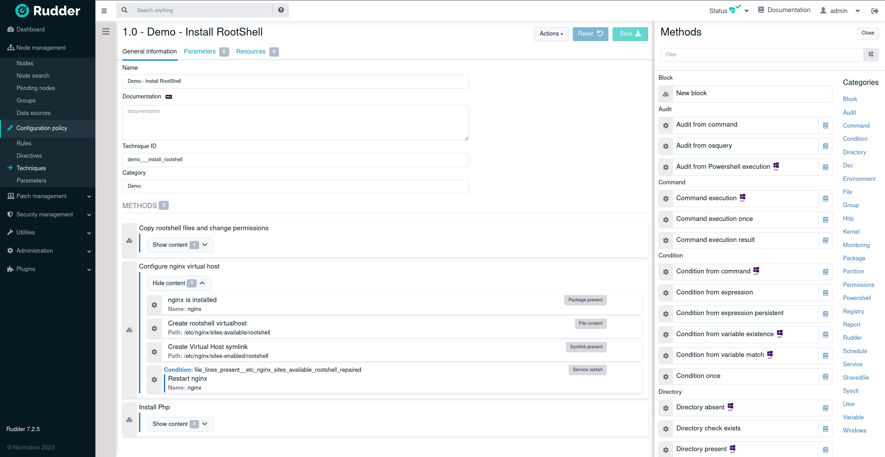

# Rudder techniques

This guide covers the usage of YAML-based techniques in [Rudder](https://www.rudder.io),
including the techniques syntax and usage of the `rudderc`
tool.

## Overview

Techniques in Rudder are system configuration or audit templates,
which can include extra files and take parameters.
They are instantiated inside of Rudder by directives,
which are in turn linked to rules to be applied.
Techniques are based on building blocks called methods,
which control basic items (like the content of a file
or its permissions).

Rudder includes a graphical editor for techniques, providing easy access
creation and customization of configuration policies in Rudder.



In addition to this visual editor, it is possible to create and modify
techniques as code, in YAML format, like:

```yaml
{{#include ../examples/ntp/technique.yml}}
```

These two representations are equivalent, and you will soon be able to use both of them to edit the same technique.
