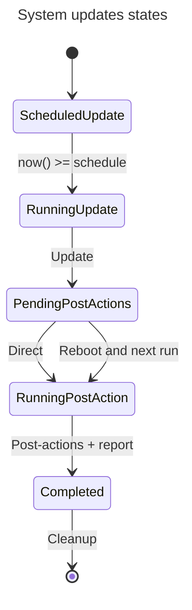

# System-updates module

This module implements the patch management feature on Linux systems. It is available through the
patch management feature of Rudder, in the `system-updates` plugin.

## Usage

The module is automatically used by the system update campaigns when applied from an 8.2+ server to an 8.2+ node on a
compatible
operating system.
It is called by the agent, and provides a native interaction with it.

### Compatibility & fallback

The minimal Rudder agent versions supporting the module is 8.2, and the minimal versions supported by the module are:

* Ubuntu 18.04 LTS
* Debian 10
* RHEL 7
* SLES 12

When the OS is older or on agents older than Rudder 8.2, the fallback Python-based implementation, distributed
with the technique, is used.

### CLI

The module provides a CLI to help debug and track the past events on a system.

```shell
$ /opt/rudder/bin/rudder-module-system-updates --help
Usage: /vagrant/rudder/target/debug/rudder-module-system-updates [OPTIONS]

Optional arguments:
  -h, --help     print help message
  -v, --verbose  be verbose

Available commands:
  list   list upgrade events
  show   show details about a specific event
  run    run an upgrade
  clear  drop database content
```

### Trigger an immediate event

Once an event is scheduled on a system using the technique, it is possible to trigger an immediate execution
by defining a special condition in the agent. You need the event id (in the form of a UUID), and to use:

```shell
rudder agent run -D ${event_id}_force_now
rudder agent run -D 70fbe730-3a88-4c27-bfbe-26f799c04b1a_force_now
```

This will modify the scheduling and run the event immediately.

## Design

### Interface with the agent

As our first module implementation in production, we chose to target the patch management feature of Rudder. On Linux it
currently runs using a Python script that was assembled for the technical preview phase, but now needs to be replaced by
a more industrialized solution.

The interface with the agent is a bit peculiar, as we have a dedicated reporting process for system updates. We send a
JSON object in a special report type. The problem is that our custom promise type interface only allows passing CFEngine
classes and an outcome status, but no variables.
To circumvent this, we pass file paths as parameters where the module will write its output.

An additional complication is that we want to capture the logs for sending them to the server, but also to display them
live for debugging.

```json
{
  "software-updated": [
    {
      "name": "xz",
      "arch": "x86_64",
      "old-version": "(none):5.2.4-3.el8",
      "new-version": "(none):5.2.4-4.el8",
      "action": "updated"
    }
  ],
  "status": "repaired",
  "output": "Last metadata expiration check: 0:08:16 ago on Wed Jul  6 18:01:05 2022.\nDependencies resolved.\n=======================================================================================\n Package               Arch    Version                                 Repo        Size\n=======================================================================================\nUpgrading:\n cockpit-packagekit    noarch  272-1.el8                               appstream  630 k\n curl                  x86_64  7.61.1-22.el8.3                         baseos     352 k\n dbus                  x86_64  1:1.12.8-18.el8.1                       baseos      41 k\n dbus-common           noarch  1:1.12.8-18.el8.1                       baseos                            \n  vim-filesystem-2:8.0.1763-19.el8.4.noarch                                     \n  vim-minimal-2:8.0.1763-19.el8.4.x86_64                                        \n  xz-5.2.4-4.el8.x86_64                                                         \n  xz-devel-5.2.4-4.el8.x86_64                                                   \n  xz-libs-5.2.4-4.el8.x86_64                                                    \n\nComplete!\n"
}

```

### System detection

We need a generic system detection method for the modules in general. This is provided by an
[os-release](https://www.freedesktop.org/software/systemd/man/latest/os-release.html) parser,
as all supported Linux systems should have it.
We made the choice to avoid any limitation in the component itself, and let the modules
chose their OS enums depending on their needs.
In the system-updates module, we need to identify the package manager to use,
and for APT, to identify the distribution.

### System actions

All the supported operating systems in the Linux patch management come with systemd, so we can
rely on it for services management and system reboot, providing a unified interface.

In practice, we use the `systemctl reboot` and `systemctl restart <SERVICES>` commands. A future
deeper integration could rely on a library leveraging the C or DBus APIs.

### Storage

The event data is stored in a SQLite database stored in `/var/rudder/system-update/rudder-module-system-updates.sqlite`.
You can access it with the SQLite CLI:

```shell
sqlite3 /var/rudder/system-update/rudder-module-system-updates.sqlite
```

### Runner

This module is quite different for most others, as it is not stateless but requires storage as the actions
can span acros several agent runs.



### Logging/Output

We want to capture the logs for sending them to the server, but also to display them live for debugging.

### Package managers

We need to support the most common package managers on Linux. There are two possible approaches, either using a generic
package manager interface or using an interface specific to each package manager.

Even if the first approach is more flexible, we decided to use the second approach for the following reasons:

* The package manager interface is quite simple and the code duplication is minimal.
* We can use the package manager CLI interface for debugging and understanding what happens.

#### DNF/YUM

We use a single interface for both `dnf` and `yum`, as they are quite similar. We use the `yum` CLI interface, as it
compatible with both package managers,
and `yum` is aliased to `dnf` on recent systems:

```shell
[root@centos9 ~]# ls -ahl /usr/bin/yum
lrwxrwxrwx. 1 root root 5 Apr  1  2024 /usr/bin/yum -> dnf-3
```

For required reboot detection, we use the `needs-restarting` command from the `yum-utils` package, called with `needs-restarting --reboothint`. For the services to restart, we use the same command with `needs-restarting --services`.

#### Zypper

We use the `zypper` command line.

For required reboot detection, we use the `zypper ps` command with the `zypper ps -s` options. For the services to restart, we use `zypper ps -sss`.

#### APT

We decided to use the `libapt` C++ library through Rust bindings instead of the CLI interface. This has several
advantages:

* Allow doing security-only upgrades sanely (like `unattended-upgrade`, the only official way, does), without disabling
  core repositories.
* Share the APT cache for the best performance and always up-to-date cache.

The drawbacks:

* Makes the build a bit more cumbersome.
* Prevents being able to run an equivalent command easily for debugging or understanding what happens.

We are on par with other tools using the `python-apt` library, which provides a similar interface.

The APT support is enabled with the `apt` feature:

```shell
cargo build --release --features=apt
```

For required reboot detection, we use the presence of the `/var/run/reboot-required` file, as done by `unattended-upgrade`. For the services to restart, we use the `needrestart` command from the `needrestart` package, called with `needrestart -r l -b`.

As we want to have a common interface and workflow for different package managers, we disable automatic service restart in APT interactions by setting the `NEEDRESTART_SUSPEND` environment variable, and we only use `needrestart` to get the list of services to restart, but not actually performing the restart.

### Security

This module needs to run as root, and protects its database with `600` permissions.
