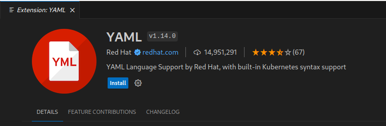
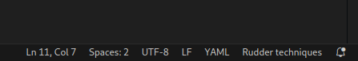
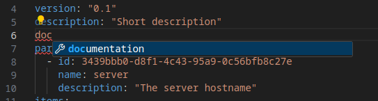
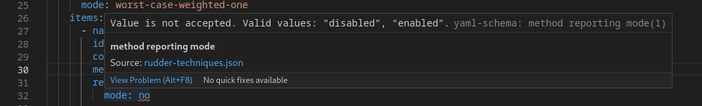

# Usage

## The `rudderc` CLI

Rudder comes with a tool dedicated to the
techniques development and usage.
It is especially important as techniques are not run as YAML, but compiled into
an executable policy file depending on the target platform.
There are currently two possible targets, which are the platforms Rudder has agents for:

* Linux
* Windows

These platforms use different agent technology, but the YAML policies
unify them.

### Create a technique

To setup the technique structure:

```shell
$ rudderc new my_technique
       Wrote ./my_technique/technique.yml

$ cd my_technique
```

This will create the base structure of your new technique:

```text
my_technique/
  ├── technique.yml
  ├── resources/
  └── tests/
```

The `technique.yml` is the technique content,
and the `resources` directory can be used to include
external files (configuration files, templates, etc.).
The tests directory will contain your technique's tests.
All files produced by `rudderc` will be placed in the `target`
directory.

### Check a technique

You can check the current technique syntax with:

```shell
$ rudderc check
        Read 179 methods (/path/to/methods/lib)
   Compiling my_technique v0.1 [Linux]
   Compiling my_technique v0.1 [Windows]
     Checked technique.yml
```

This will check the technique [schema](https://raw.githubusercontent.com/Normation/rudder/master/policies/rudderc/src/technique.schema.json) and check the compilation
to the target platforms.

### Compile for the target platforms

```shell
$ rudderc build
        Read 179 methods (/path/to/methods/lib)
   Compiling my_technique v0.1 [Linux]
       Wrote target/technique.cf
   Compiling my_technique v0.1 [Windows]
       Wrote target/technique.ps1
  Generating my_technique v0.1 [Metadata]
       Wrote target/metadata.xml
      Copied resources
```

### Clean files

The `clean` command allows removing all generated files.

```shell
$ rudderc clean
     Cleaned target
```

### Build the documentation

You can build this documentation directly using `rudderc`.
This can be specially useful if you use custom methods not
present in the public documentation.

```shell
$ rudderc lib
        Read 179 methods (/.../ncf/tree/30_generic_methods/)
Book building has started
Running the html backend
       Wrote target/doc/book/index.html
```

To open the documentation in your browser after build, pass the `--open` option.

## Import a technique into Rudder

### As a technique editor technique (using the HTTP API)

You can export your current technique with:

```shell
$ rudderc build --export
     Writing ./target/ntp_technique-0.1.zip
```

The file is named after the technique id and versions.
This will produce a configuration archive importable on a Rudder server using the
[archives HTTP API](https://docs.rudder.io/api/v/18/#tag/Archives/operation/import):

```shell
curl --header "X-API-Token: yourToken" -X POST https://rudder.example.com/rudder/api/latest/archives/import --form "archive=@ntp_technique-0.1.zip"
```

The technique will then be available for normal use.

### As a technique editor technique (on the server file system)

The technique editor is able to directly use the YAML format (but does not support technique parameter types
for now, and does not display tags). You can either import the technique using the import button in the
Web interface, or if you want to automate it, with:

```shell
cd /var/rudder/configuration-repository/
mkdir -p CATEGORY/MY_TECHNIQUE/1.0/
cp /path/to/technique.yml  CATEGORY/MY_TECHNIQUE/1.0/
git add CATEGORY/MY_TECHNIQUE/
git commit -m "Add my technique"
rudder server reload-techniques
```

### As a built-in technique

To add a YAML technique as a built-in technique, which gives access to the full power of
parameter types, you need to run these commands on your server:

```shell
rudderc build
cd /var/rudder/configuration-repository/techniques/
mkdir -p CATEGORY/MY_TECHNIQUE/1.0/
cp -r /path/to/technique/target/* CATEGORY/MY_TECHNIQUE/1.0/
git add CATEGORY/MY_TECHNIQUE/
git commit -m "Add my technique"
rudder server reload-techniques
```

*Warning*: `rudder server reload-techniques` is an asynchronous command.
It returns immediately with a success, and
you need to check web application logs for errors (`/var/log/rudder/webapp/`) afterwards.

Once imported, the technique will be available like built-in ones, in the directives' page.
To update the technique, repeat the import steps.


## Editor/IDE integration

We provide a [JSON schema](https://raw.githubusercontent.com/Normation/rudder/master/policies/rudderc/src/technique.schema.json)
for Rudder YAML techniques.
This schema can be automatically used for all your techniques files in most editors,
as it's part of [JSON Schema Store](https://www.schemastore.org/json/).

### Visual Studio Code

You need to install the `YAML` plugin in the extension manager:



You're all set! Now, when you open any technique file, the schema will be applied automatically
as shown in the file type indicating "Rudder technique".



You now have access to basic linting and autocompletion on technique fields:





### Other editors

You can also use:

* All JetBrains editors (IntelliJ IDEA, PyCharm, etc.) work without any configuration
* All editors using the [YAML language server](https://github.com/redhat-developer/yaml-language-server)
  (Helix after installing `yaml-language-server`, SublimeText with the `LSP-yaml` plugin, etc.)
* NeoVim using the [SchemaStore](https://github.com/b0o/SchemaStore.nvim) plugin
