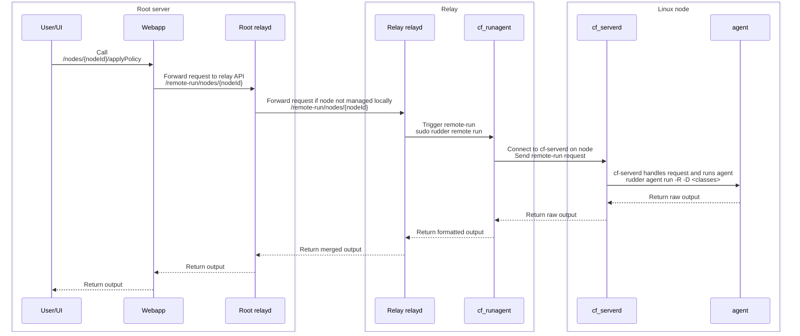
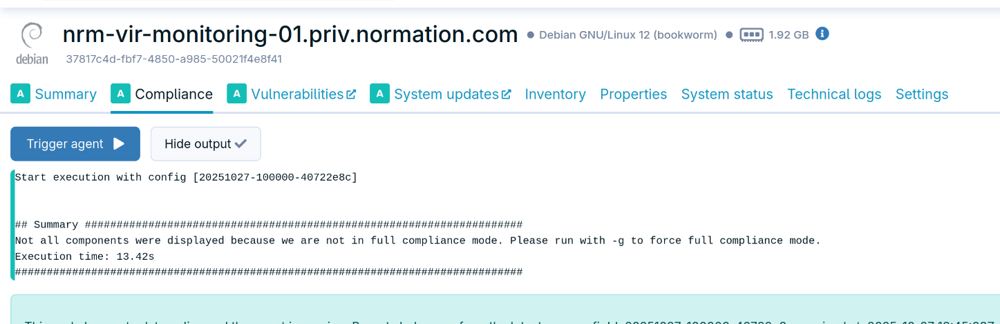

# Remote run

## Overview

The remote-run feature in Rudder allows triggering the execution of an agent from a network call. This is useful to immediately apply changes (especially on infrastructures with lower agent run frequency) or to get instant feedback from an agent without SSH access.

This document presents the state of this feature in 9.0.0, but it is not really version-specific and has worked that way for a long time.

It closes on the possible future improvements.

## Current implementation

The remote-run is currently only implemented for the Linux agent, as it relies on CFEngine features.



### On the Linux node

The remote-run triggers are received on the network by the `rudder-cf-serverd` service. It is an optional service on the nodes,
where it can be disabled (mainly for security reasons). In this case remote-run is impossible.

When enabled, the service listens on a TCP port (by default 5309) for incoming connections.
Its configuration contains:

* `cfruncommand`: the command to run when a remote-run request is received. It is always `rudder agent run -R` (normal run, but with raw output)
* An `admit_keys` configuration for the run command, which contains the public keys of the relay authorized to trigger remote-runs on the node.

```cfengine
  "${g.rudder_command}" comment => "Grant access to rudder agent command for cfruncommand",
    admit_keys => { "MD5=1ec2213e08921bd3444861f7b4a60919" };
```

We allow any classes to be passed to the agent:

```cfengine
  roles:
      # Allow user root to set any class
      ".*"  authorize => { "root" };
```

They are added to the agent command line with the `-D` option.

NOTE: CFEngine classes are usually called conditions in the Rudder context. The `force_inventory` class is a well-known example of a class that can be passed to the agent to trigger an inventory run during the run.

When a connection is received, the service reads the request, checks the authentication using the relay's public key, and if valid,
runs the agent and sends back the raw output. The command runs with the same user as the `rudder-cf-serverd` service (i.e., `root`).

### On the relay

The relay is responsible for running or forwarding the remote-run requests. It exposes an [HTTP API](https://docs.rudder.io/api/relay/v/1/#tag/Remote-run/operation/remoteRunNodes) that allows triggering a remote-run on:

* All nodes
* A specific node
* A list of nodes

It can take several parameters:

* `classes`/`conditions` (alias): an optional list of classes to apply during the run. This allows modifying the agent's behavior (e.g. trigger an inventory during the run)
* `asynchronous`: a boolean indicating if the request should be blocking or not
* `keep_output`: a boolean indicating if the output of the run should be sent back to the caller

When several nodes run in the same request, the outputs are merged. The output is always a raw stream of bytes.

The `rudder-relayd` service is capable of triggering runs on its direct managed nodes only. If the target node is not managed by the relay, it forwards the request to the appropriate relay on its HTTP API. The entry point for this API is the local `rudder-relayd` service on the root server.

When a remote-run request is received for a node managed by the relay, it triggers the remote-run by running `sudo rudder remote run <node-id>` on the target node, optionally passing a list of classes with the `-D` option.
This command then call `cf-runagent` which talks on the network to the `rudder-cf-serverd` service to trigger the run, and passes the output through the local (awk-based) formatter to get the pretty output. It uses the relay's
private key to authenticate to the service (which is why a `sudo` is required).

This service was ported in Rust from the previous Python implementation, which worked the same way.

### On the server

The public API exposes [an endpoint](https://docs.rudder.io/api/v/21/#tag/Nodes/operation/applyPolicy) (`/nodes/{nodeId}/applyPolicy`) to trigger remote-runs on a node, which is forwarded to the local relay's HTTP API.
It runs the relay API with the `asynchronous = false` and `keep_output = true` parameters, so the caller gets the output of the run streamed back.
It takes a list of classes/conditions as an optional (undocumented) parameter.

```scala
val request = {
  remoteRunRequest(nodeId, classes, keepOutput = true, asynchronous = false)
    .timeout(connTimeoutMs = 1000, readTimeoutMs = readTimeout.toMillis.toInt)
}
```

The endpoint is currently exposed in the node details with a *Trigger agent* button in the compliance tab. It displays the output of the run once finished.



## Future improvements

We plan to replace the Windows schedule task and Linux `cf-execd` daemon with a common in-house implementation in Rust.
It would handle the local agent runs (every N minutes) as well as remote run requests, and would be more robust and easier to maintain.
It would in particular not run as root but use a dedicated user with limited privileges and have limited privilege escalation mechanisms to run the agent as root when needed.

The network part will be HTTPS-based, with proper authentication and authorization mechanisms.
The development of this component will start during the 9.X series.