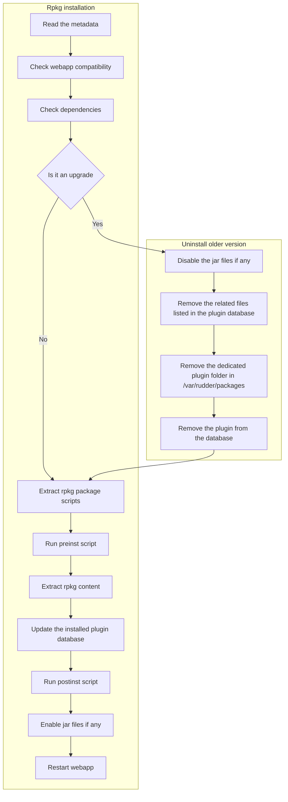

# Rpkg spec

A rpkg is an `ar` archive with the `.rpkg` extension containing:

* a metadata in **JSON**
* a tarball named `scripts.txz` containing the plugin package scripts if any
    * `preinst`
    * `postinst`
    * `prerm`
    * `postrm`
* one or more tarballs in `txz` format that contain the plugin files

## Metadata

```Json
{
  "type": "plugin",
  "name": "myplugin",
  "version": "4.1-1.0",
  "description": ""
  "build-date": "2017-02-22T13:58:23Z",
  "build-commit": "34aea1077f34e5abdaf88eb3455352aa4559ba8b",
  "jar-files": [ "test.jar" ],
  "depends": {
    "binary": [ "zip" ]
    "apt": [ "apache2" ],
    "rpm": [ ],
    "python": []
  },
  "content": {
    "files.txz": "/opt/rudder/share",
    "var_rudder.txz": "/var/rudder"
  }
}
```
| **Field**          | **Type**               | **Mandatory** | **Details**                                                                                     |
|---------------------|------------------------|---------------|-------------------------------------------------------------------------------------------------|
| `type`             | String                | Yes           | Specifies the type of the rpkg. Only the value `"plugin"` is currently supported.                               |
| `name`             | String                | Yes           | The name of the plugin.                                    |
| `version`          | String                | Yes           | The version of the compatible webapp and the version of the plugin concatenated by a `-`.                                 |
| `description`      | String                | No            | A brief description of the plugin. This can be empty or omitted.                              |
| `build-date`       | String (RFC 3339)     | Yes           | The date and time when the plugin was built, in RFC 3339 format.                              |
| `build-commit`     | String (SHA1 hash)    | Yes           | The Git commit hash associated with the build.                                                |
| `jar-files`        | Array of Strings      | Yes           | A list of jar file names included in the plugin. An empty list if no jar files are needed.                                          |
| `depends`          | Object                | No           | Lists dependencies required for the plugin to function. Each key represents a type of dependency (`binary`, `apt`, `rpm` or `python`) and maps to an array of specific dependencies. |
| `content`          | Object                | Yes           | Maps file archives to their installation paths within the system.                             |


### Subfields of `depends`
| **Field** | **Type**          | **Mandatory** | **Details**                                                                  |
|-----------|-------------------|---------------|------------------------------------------------------------------------------|
| `binary`  | Array of Strings | No            | Dependencies that are binary packages and have to be available in `PATH`.     |
| `apt`     | Array of Strings | No            | Dependencies for APT-based systems.                                        |
| `rpm`     | Array of Strings | No            | Dependencies for RPM-based systems.                                           |
| `python`  | Array of Strings | No            | Dependencies that are Python packages.                                        |

### Version format

The `version` field listed in the metadata is built from the Rudder version the plugin was built for and the actual plugin version, concatenated by a `-`. It can be seen as `<Rudder webapp version>-<plugin version>`.

A plugin is only compatible with a Rudder webapp in the exact same version than the one listed in the `version` field of its metadata. For instance, a plugin with a metadata containing
```json
"version": "8.0.1~rc3-2.9"
```
Will be compatible with a Rudder in `8.0.1~rc3` but not with a Rudder in `8.0.1` as their version differs.

The `<plugin version>` of the `version` field must follow the format: `^(?<major>\d+)\.(?<minor>\d+)(-nightly)?$`.

⚠️ If a plugin version contains `-nightly` it means that it was built for a Rudder webapp version in nightly, not that the plugin version is a nightly in itself.

Some examples:
| **Rpkg version**          | **Rudder webapp version** | **Compatible** |
|----------------------------|---------------------------|----------------|
| 8.0.1-2.9                 | 8.0.1                    | ✅             |
| 8.0.1-2.9-nightly         | 8.0.1~git2024            | ✅             |
| 8.0.1-2.9-nightly         | 8.0.1                    | ❌             |
| 8.0.1~rc3-2.9             | 8.0.1                    | ❌             |
| 8.0.1~rc3-2.9             | 8.0.1~rc3                | ✅             |
| 8.0.2~rc3-2.9             | 8.0.2~rc2                | ❌             |
| 8.0.2~beta1-2.9           | 8.0.2~beta1              | ✅             |
| 8.0.2~alpha1.2-2.9        | 8.0.2\~alpha2~git12345    | ❌             |


## Package scripts

Package scripts are executables that are run at specific timing during the installation/uninstallation process.
They are expected to return 0, otherwise the installation/uninstallation will be aborted.

They **must** be packaged inside the `scripts.txz` archive in the rpkg. And they will always be unpacked on the Rudder server under `/var/rudder/packages/rudder-plugin-<plugin name from metadata>`.

## Plugin content

A plugin can contain multiple archives that will be unpacked on different locations on the system at install time.
Each file deployed this way will be removed when the plugin will be uninstalled.

Each content archive must be listed in the metadata under the `contents` field, using the archive name as key, and the target installation path as value.

```json
  "content": {
    "files.txz": "/opt/rudder/share",
    "var_rudder.txz": "/var/rudder"
  }
```


## RPKG installation flowchart

A failure in any of the steps in the schema below will abort the plugin installation without cleaning.



## Guidelines to write a plugin

* Do not deploy anything or create files under `/var/rudder/packages/rudder-plugin-<plugin-name>` as this folder is reserved for the package scripts and may be removed by the package manager.
* A dedicated default folder `/var/rudder/plugins/rudder-plugin-<plugin-name>` is expected to contain most of the plugin unpacked files.
* Any configuration file should go to `/opt/rudder/etc/plugins/rudder-plugin-<plugin-name>/`
* Any persistent data generated by the plugin should go to `/var/rudder/plugins/rudder-plugin-<plugin-name>`

