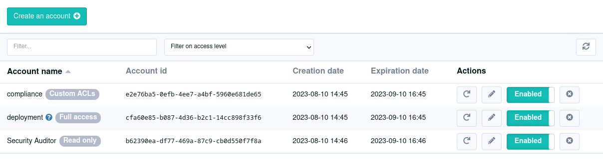
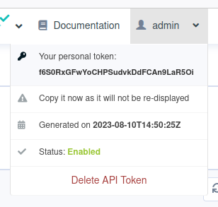
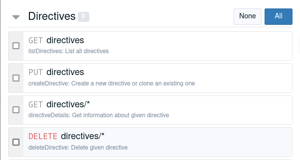

  Download OpenAPI specification: [openapi.yml](openapi.yml)

**Other documentation sources**:

* [Main documentation](https://docs.rudder.io)
* [Internal relay API](https://docs.rudder.io/api/relay/)

# Introduction

Rudder exposes a REST API, enabling the user to interact with Rudder without using the webapp, for example, in scripts or cron jobs.

## Authentication

The Rudder REST API uses simple API keys for authentication.
All requests must be authenticated (except from a generic status API).
The tokens are 32-character strings, passed in a `X-API-Token` header, like in: 

```bash
curl --header "X-API-Token: yourToken" https://rudder.example.com/rudder/api/latest/rules
```

The tokens are the API equivalent of a password, and must
be secured just like a password would be.

### API accounts

The accounts are managed in the Web interface. There are three types of accounts:

* **Global API accounts**: they are not linked to a Rudder user, and are managed by Rudder administrators in the _Administration -> API accounts_ page. You should define an expiration date whenever possible.



* **User tokens**: they are linked to a Rudder user, and give the same rights the user has.
There can be only one token by user. This feature is provided by the `api-authorizatons` plugin.



* **System token**: it is a special token, not visible in the interface. Its value is postfixed with `-system`
and is regenerated at each application restart. It is designed to allow running local calls to the API
without having to configure an account. The token is written
into `/var/rudder/run/api-token` and only readable by the `root` user. When using the token with `curl`, you should use the
alternative form to prevent leaking the token in the process list:

```
curl --header @/var/rudder/run/api-token-header
```

When an action produces a change of configuration on the server, the API account that made it will
be recorded in the event log, like for a Web interaction.

### Authorization

When using Rudder without the `api-authorizatons` plugin, only global accounts are available, with
two possible privilege levels, read-only or write.
With the `api-authorizatons` plugin, you also get access to:

* User tokens, which have the same permissions as the user, using the Rudder roles and permissions feature.
* Custom ACLs on global API accounts. They provide fine-grained permissions on every endpoint:



As a general principle,
you should create dedicated tokens with the least privilege level for each different interaction you have with the
API.
This limits the risks of exploitation if a token is stolen, and allows tracking the activity
of each token separately. Token renewal is also easier when they are only used for a limited purpose.

## Versioning

Each time the API is extended with new features (new functions, new parameters, new responses, ...), it will be assigned a new version number. This will allow you
to keep your existing scripts (based on previous behavior). Versions will always be integers (no 2.1 or 3.3, just 2, 3, 4, ...) or `latest`.

You can change the version of the API used by setting it either within the url or in a header:

* the URL: each URL is prefixed by its version id, like `/api/version/function`.

```bash
# Version 10
curl -X GET -H "X-API-Token: yourToken" https://rudder.example.com/rudder/api/10/rules
# Latest
curl -X GET -H "X-API-Token: yourToken" https://rudder.example.com/rudder/api/latest/rules
# Wrong (not an integer) => 404 not found
curl -X GET -H "X-API-Token: yourToken" https://rudder.example.com/rudder/api/3.14/rules
```

* the HTTP headers. You can add the **X-API-Version** header to your request. The value needs to be an integer or `latest`.

```bash
# Version 10
curl -X GET -H "X-API-Token: yourToken" -H "X-API-Version: 10" https://rudder.example.com/rudder/api/rules
# Wrong => Error response indicating which versions are available
curl -X GET -H "X-API-Token: yourToken" -H "X-API-Version: 3.14" https://rudder.example.com/rudder/api/rules
```

In the future, we may declare some versions as deprecated, in order to remove them in a later version of Rudder, but we will never remove any versions without warning, or without a safe
period of time to allow migration from previous versions.


<h4>Existing versions</h4>
<table>
  <thead>
    <tr>
      <th style="width: 20%">Version</th>
      <th style="width: 20%">Rudder versions it appeared in</th>
      <th style="width: 70%">Description</th>
    </tr>
  </thead>
  <tbody>
    <tr>
      <td class="code">1</td>
      <td class="code">Never released (for internal use only)</td>
      <td>Experimental version</td>
    </tr>
    <tr>
      <td class="code">2 to 10 (deprecated)</td>
      <td class="code">4.3 and before</td>
      <td>These versions provided the core set of API features for rules, directives, nodes global parameters, change requests and compliance, rudder settings, and system API</td>
    </tr>
    <tr>
      <td class="code">11</td>
      <td class="code">5.0</td>
      <td>New system API (replacing old localhost v1 api): status, maintenance operations and server behavior</td>
    </tr>
    <tr>
      <td class="code">12</td>
      <td class="code">6.0 and 6.1</td>
      <td>Node key management</td>
    </tr>
    <tr>
      <td class="code">13</td>
      <td class="code">6.2</td>
      <td><ul>
        <li>Node status endpoint</li>
        <li>System health check</li>
        <li>System maintenance job to purge software [that endpoint was back-ported in 6.1]</li>
      </ul></td>
    </tr>
    <tr>
      <td class="code">14</td>
      <td class="code">7.0</td>
      <td><ul>
        <li>Secret management</li>
        <li>Directive tree</li>
        <li>Improve techniques management</li>
        <li>Demote a relay</li>
      </ul></td>
    </tr>
    <tr>
      <td class="code">15</td>
      <td class="code">7.1</td>
      <td><ul>
        <li>Package updates in nodes</li>
      </ul></td>
    </tr>
    <tr>
      <td class="code">16</td>
      <td class="code">7.2</td>
      <td><ul>
        <li>Create node API included from plugin</li>
        <li>Configuration archive import/export</li>
      </ul></td>
    </tr>
    <tr>
      <td class="code">17</td>
      <td class="code">7.3</td>
      <td><ul>
        <li>Compliance by directive</li>
        <li>Path campaigns API included</li>
      </ul></td>
    </tr>
    <tr>
      <td class="code">18</td>
      <td class="code">8.0</td>
      <td><ul>
        <li>Allowed network </li>
        <li>Improve the structure of `/settings/allowed_networks` output</li>
      </ul></td>
    </tr>
    <tr>
      <td class="code">19</td>
      <td class="code">8.1</td>
      <td><ul>
        <li>Multi-tenants</li>
        <li>Scores list</li>
      </ul></td>
    </tr>
    <tr>
      <td class="code">20</td>
      <td class="code">8.2</td>
      <td><ul>
        <li>More standard format for node details fields</li>
      </ul></td>
    </tr>
    <tr>
      <td class="code">21</td>
      <td class="code">8.3</td>
      <td><ul>
        <li>API account new format</li>
        <li>Info API format evolution</li>
      </ul></td>
    </tr>
    <tr>
      <td class="code">22</td>
      <td class="code">9.0</td>
      <td><ul>
        <li>Event campaign (format, history)</li>
      </ul></td>
    </tr>
  </tbody>
</table>


## Response format

All responses from the API are in the JSON format.

```json
{
  "action": "The name of the called function",
  "id": "The ID of the element you want, if relevant",
  "result": "The result of your action: success or error",
  "data": "Only present if this is a success and depends on the function, it's usually a JSON object",
  "errorDetails": "Only present if this is an error, it contains the error message"
}
```


* __Success__ responses are sent with the 200 HTTP (Success) code

* __Error__ responses are sent with a HTTP error code (mostly 5xx...)


## HTTP method

Rudder's REST API is based on the usage of [HTTP methods](http://www.w3.org/Protocols/rfc2616/rfc2616-sec9.html). We use them to indicate what action will be done by the request. Currently, we use four of them:


* **GET**: search or retrieve information (get rule details, get a group, ...)

* **PUT**: add new objects (create a directive, clone a Rule, ...)

* **DELETE**: remove objects (delete a node, delete a parameter, ...)

* **POST**: update existing objects (update a directive, reload a group, ...)


## Parameters

### General parameters

Some parameters are available for almost all API functions. They will be described in this section.
They must be part of the query and can't be submitted in a JSON form.

#### Available for all requests

<table>
  <thead>
    <tr>
      <th style="width: 30%">Field</th>
      <th style="width: 10%">Type</th>
      <th style="width: 70%">Description</th>
    </tr>
  </thead>
  <tbody>
    <tr>
      <td class="code">prettify</td>
      <td><b>boolean</b><br><i>optional</i></td>
      <td>
        Determine if the answer should be prettified (human friendly) or not. We recommend using this for debugging purposes, but not for general script usage as this does add some unnecessary load on the server side.
        <p class="default-value">Default value: <code>false</code></p>
      </td>
    </tr>
  </tbody>
</table>


#### Available for modification requests (PUT/POST/DELETE)

<table>
  <thead>
    <tr>
      <th style="width: 25%">Field</th>
      <th style="width: 12%">Type</th>
      <th style="width: 70%">Description</th>
    </tr>
  </thead>
  <tbody>
    <tr>
      <td class="code">reason</td>
      <td><b>string</b><br><i>optional</i> or <i>required</i></td>
      <td>
        Set a message to explain the change. If you set the reason messages to be mandatory in the web interface, failing to supply this value will lead to an error.
        <p class="default-value">Default value: <code>""</code></p>
      </td>
    </tr>
    <tr>
      <td class="code">changeRequestName</td>
      <td><b>string</b><br><i>optional</i></td>
      <td>
        Set the change request name, is used only if workflows are enabled. The default value depends on the function called
        <p class="default-value">Default value: <code>A default string for each function</code></p>
      </td>
    </tr>
    <tr>
      <td class="code">changeRequestDescription</td>
      <td><b>string</b><br><i>optional</i></td>
      <td>
        Set the change request description, is used only if workflows are enabled.
        <p class="default-value">Default value: <code>""</code></p>
      </td>
    </tr>
  </tbody>
</table>


### Passing parameters

Parameters to the API can be sent:

* As part of the URL for resource identification

* As data for POST/PUT requests

  * Directly in JSON format

  * As request arguments

#### As part of the URL for resource identification

Parameters in URLs are used to indicate which resource you want to interact with. The function will not work if this resource is missing.

```bash
# Get the Rule of ID "id"
curl -H "X-API-Token: yourToken" https://rudder.example.com/rudder/api/latest/rules/id
```

CAUTION: To avoid surprising behavior, do not put a '/' at the end of a URL: it would be interpreted as '/[empty string parameter]' and redirected to '/index', likely not what you wanted to do.


#### Sending data for POST/PUT requests

##### Directly in JSON format

JSON format is the preferred way to interact with Rudder API for creating or updating resources.
You'll also have to set the *Content-Type* header to **application/json** (without it the JSON content would be ignored).
In a `curl` `POST` request, that header can be provided with the `-H` parameter:

```bash
curl -X POST -H "Content-Type: application/json" ...
```

The supplied file must contain a valid JSON: strings need quotes, booleans and integers don't, etc.

The (human-readable) format is:

```json
{
  "key1": "value1",
  "key2": false,
  "key3": 42
}
```

Here is an example with inlined data:

```bash
# Update the Rule 'id' with a new name, disabled, and setting it one directive
curl -X POST -H "X-API-Token: yourToken" -H  "Content-Type: application/json"
https://rudder.example.com/rudder/api/rules/latest/{id}
  -d '{ "displayName": "new name", "enabled": false, "directives": "directiveId"}'
```

You can also pass a supply the JSON in a file:

```bash
# Update the Rule 'id' with a new name, disabled, and setting it one directive
curl -X POST -H "X-API-Token: yourToken" -H "Content-Type: application/json" https://rudder.example.com/rudder/api/rules/latest/{id} -d @jsonParam
```

Note that the general parameters view in the previous chapter cannot be passed in a JSON, and you will need to pass them a URL parameters if you want them to be taken into account (you can't mix JSON and request parameters):

```bash
# Update the Rule 'id' with a new name, disabled, and setting it one directive with reason message "Reason used"
curl -X POST -H "X-API-Token: yourToken" -H "Content-Type: application/json" "https://rudder.example.com/rudder/api/rules/latest/{id}?reason=Reason used" -d @jsonParam -d "reason=Reason ignored"
```

##### Request parameters

In some cases, when you have little, simple data to update, JSON can feel bloated. In such cases, you can use
request parameters. You will need to pass one parameter for each data you want to change.

Parameters follow the following schema:

```
key=value
```

You can pass parameters by two means:

* As query parameters: At the end of your url, put a **?** then your first parameter and then a **&** before next parameters. In that case, parameters need to be https://en.wikipedia.org/wiki/Percent-encoding[URL encoded]

```bash
# Update the Rule 'id' with a new name, disabled, and setting it one directive
curl -X POST -H "X-API-Token: yourToken"  https://rudder.example.com/rudder/api/rules/latest/{id}?"displayName=my new name"&"enabled=false"&"directives=aDirectiveId"
```

* As request data: You can pass those parameters in the request data, they won't figure in the URL, making it lighter to read, You can pass a file that contains data.

```bash
# Update the Rule 'id' with a new name, disabled, and setting it one directive (in file directive-info.json)
curl -X POST -H "X-API-Token: yourToken"
https://rudder.example.com/rudder/api/rules/latest/{id} -d "displayName=my new name" -d "enabled=false" -d @directive-info.json
```
